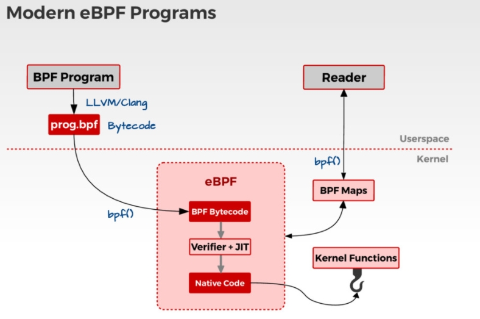
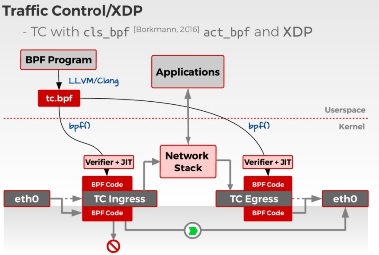
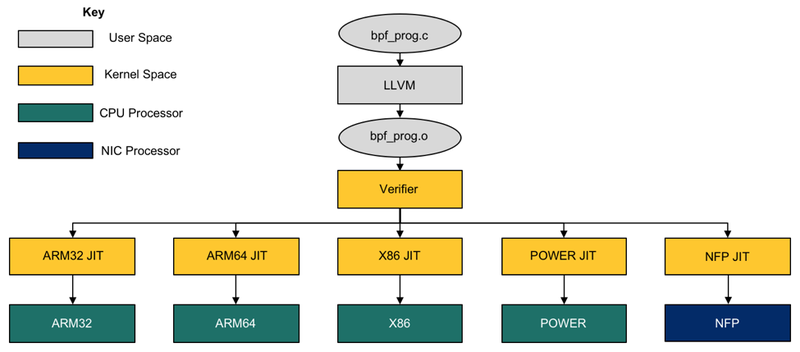

# BPF

1. BPF aka cBPF:

    BPF, as in Berkeley Packet Filter, was initially conceived in 1992 so as to provide a way to filter packets and to avoid useless packet copies from kernel to userspace. It initially consisted in a simple bytecode that is injected from userspace into the kernel, where it is checked by a verifier—to prevent kernel crashes or security issues—and attached to a socket, then run on each received packet. It was ported to Linux a couple of years later, and used for a small number of applications (tcpdump for example). The simplicity of the language as well as the existence of an in-kernel Just-In-Time (JIT) compiling machine for BPF were factors for the excellent performances of this tool.

    BPF Programs is A safe, runtime way to extend Linux kernel capabilities,Functions, Maps, Attachment Points, Syscall.

    Properties:
    - Network packet filtering, eventually seccomp
    - Filter Expressions -> Bytecode ->interpret*
    - Small, in-kernel VM. Register based, witch dispathc interpreter, few instructions

2. eBPF:

    Then in 2013, Alexei Starovoitov completely reshaped it, started to add new functionalities and to improve the performances of BPF. This new version is designated as eBPF (for “extended BPF”), while the former becomes cBPF (“classic” BPF). New features such as maps and tail calls appeared. The JIT machines were rewritten. The new language is even closer to native machine language than cBPF was. And also, new attach points in the kernel have been created.

    Properties:
    - More registrers, JIT compiler(flexible/faster), verifier
    - Attach on Tracepoint/Kprobe/Uprobe/USDT
    - in-kernel trace aggreagation & filtering
    - Controll via **bpf()**, trace collection via **BPF Maps**
    - Upstream in linux kernel( **bpf()** syscall, v3.18+)
    - Bytecode compilation upstream in LLVM/Clang

    2.1 BPF use cases
    - forwarding data: recently BPF improvements called “Sockmap” that we have upstreamed into the Linux kernel, which secure redirection at the socket layer itself.  cilium used this feature

    - filtering:  previous iptables focus on packets, IP addresses, and ports, and BPF instead treating service identity and API protocols (e.g., HTTP, gRPC, and Kafka) as first-class citizens in the platform for filtering .  ----> for security area, take cilium for example

    - visibility: can be used to construct the monitoring and tracing applications, for example BCC

    2.2 other projects based on BPF

    Some others, such as CETH(Common Ethernet Driver Framework), Cilium, are entirely based on it. BPF is buzzing, so we can expect a lot of tools and projects to orbit around it soon

    2.3 Uage of BPF program
        
        

 3. XDP

    XDP or eXpress Data Path provides a high performance, programmable network data path in the Linux kernel as part of the IO Visor Project.XDP provides bare metal packet processing at the lowest point in the software stack which makes it ideal for speed without compromising programmability.

    XDP is a framework for running BPF in the driver.

    3.1 XDP Feature
    - The XDP packet process includes an in kernel component that processes RX packet-pages directly out of driver via a functional interface without early allocation of skbuff’s or software queues.
    - BPF programs performs processing such as packet parsing, table look ups, creating/managing stateful filters, encap/decap packets, etc.

    

    https://github.com/iovisor/bpf-docs/blob/master/Express_Data_Path.pdf
    http://www.tk4479.net/dog250/article/details/77993218

    The network processing module is listed as below:

    
    The key difference here being that eBPF adds an additional hook in driver space. This hook is called eXpress DataPath, or XDP. This allows users to drop, reflect or redirect packets before they have an skb (socket buffer) metadata structure added to the packet

    Offloading eBPF to the NFP
    Back in 4.9,  Network Flow Processor (NFP) BPF JIT-compiler  is added to the kernel, initially for cls_bpf (https://www.spinics.net/lists/netdev/msg379464.html).Through the NFP JIT, we have managed to effectively modify the program flow as shown in the diagram below:
    

    That is the network packets are processed by the NIC itself processors.

    > The key reason this was possible was because of how well the BPF machine maps to our flow processing cores on the NFP, this means that the NFP-based Agilio CX SmartNIC running at between 15-25W can offload a significant amount of processing from the host. In the load balancing example below, the NFP processes the same amount of packets as nearly 12 x86 cores from the host combined, an amount physically impossible for the host to handle due to PCIe bandwidth restrictions (Cores used: Intel Xeon CPU E5-2630 v4 @ 2.20GHz).

    3.2 comparison between XDP and traditional Linux Kernel Networking
    - Traditionally Linux Kernel Networking
        -  Rely on meta-data struct sk_buff (called "SKB")
            - Keep state and pointers to real packet-data
            - Assume most pkts reach deep into netstack (socket delivery)
        - Take alloc, setup and clear cost of SKB "upfront"
    - XDP change this: “new layer in network stack”
        - XDP gives access to packet-data, before the SKB is allocated
        - As early as possible: hook in NIC drivers
        - Via programmable interface (eBPF)

    3.3  XDP operation modes

    - Native XDP

        This is the default mode where the XDP BPF program is run directly out of the networking driver’s early receive path. Most widespread used NICs for 10G and higher support native XDP already.

    - Offloaded XDP

        In the offloaded XDP mode the XDP BPF program is directly offloaded into the NIC instead of being   executed on the host CPU. Thus, the already extremely low per-packet cost is pushed off the host  CPU entirely and executed on the NIC, providing even higher performance than running in native XDP.  This offload is typically implemented by SmartNICs containing multi-threaded, multicore flow     processors where a in-kernel JIT compiler translates BPF into native instructions for the latter.   Drivers supporting offloaded XDP usually also support native XDP for cases where some BPF helpers     may not yet or only be available for the native mode.

    - Generic XDP

        For drivers not implementing native or offloaded XDP yet, the kernel provides an option for generic     XDP which does not require any driver changes since run at a much later point out of the networking     stack. This setting is primarily targeted at developers who want to write and test programs against     the kernel’s XDP API, and will not operate at the performance rate of the native or offloaded   modes. For XDP usage in a production environment either the native or offloaded mode is better    suited and the recommended way to run XDP.

4.

3. BPF  links
    - https://github.com/iovisor/bcc
    - https://github.com/iovisor/bpf-docs
    -

