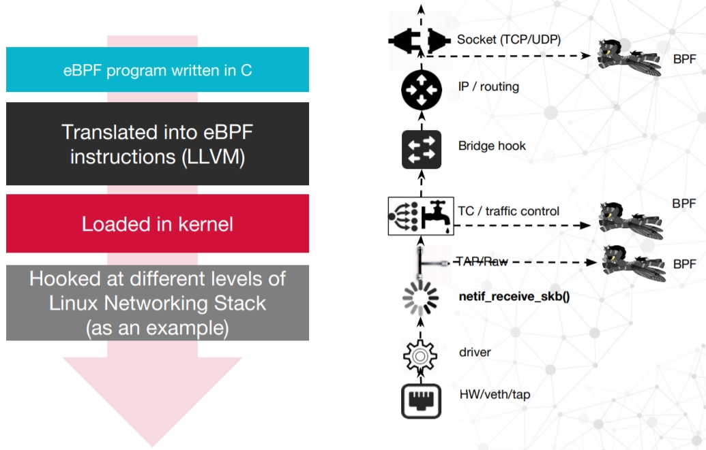

1. BPF aka cBPF:

    BPF, as in Berkeley Packet Filter, was initially conceived in 1992 so as to provide a way to filter packets and to avoid useless packet copies from kernel to userspace. It initially consisted in a simple bytecode that is injected from userspace into the kernel, where it is checked by a verifier—to prevent kernel crashes or security issues—and attached to a socket, then run on each received packet. It was ported to Linux a couple of years later, and used for a small number of applications (tcpdump for example). The simplicity of the language as well as the existence of an in-kernel Just-In-Time (JIT) compiling machine for BPF were factors for the excellent performances of this tool.

    BPF Programs is A safe, runtime way to extend Linux kernel capabilities,Functions, Maps, Attachment Points, Syscall.

    Properties:
    - Network packet filtering, eventually seccomp
    - Filter Expressions -> Bytecode ->interpret*
    - Small, in-kernel VM. Register based, witch dispathc interpreter, few instructions

2. eBPF:
    Then in 2013, Alexei Starovoitov completely reshaped it, started to add new functionalities and to improve the performances of BPF. This new version is designated as eBPF (for “extended BPF”), while the former becomes cBPF (“classic” BPF). New features such as maps and tail calls appeared. The JIT machines were rewritten. The new language is even closer to native machine language than cBPF was. And also, new attach points in the kernel have been created.

    Properties:
    - More registrers, JIT compiler(flexible/faster), verifier
    - Attach on Tracepoint/Kprobe/Uprobe/USDT
    - in-kernel trace aggreagation & filtering
    - Controll via **bpf()**, trace collection via **BPF Maps**
    - Upstream in linux kernel( **bpf()** syscall, v3.18+)
    - Bytecode compilation upstream in LLVM/Clang

    2.1 eBPF for kernerl tracing and event monitoring

     eBPF programs can be designed for a variety of use cases, that divide into two fields of applications. One of them is the domain of kernel tracing and event monitoring. BPF programs can be attached to kprobes and they compare with other tracing methods, with many advantages (and sometimes some drawbacks).
    
    2.2 eBPF for network package filtering

    The other application domain remains network programming. In addition to socket filter, eBPF programs can be attached to tc (Linux traffic control tool) ingress or egress interfaces and perform a variety of packet processing tasks, in an efficient way. This opens new perspectives in the domain.
    
    2.3 XDP
    XDP or eXpress Data Path provides a high performance, programmable network data path in the Linux kernel as part of the IO Visor Project.XDP provides bare metal packet processing at the lowest point in the software stack which makes it ideal for speed without compromising programmability.

    The XDP packet process includes an in kernel component that processes RX packet-pages directly out of driver via a functional interface without early allocation of skbuff’s or software queues. BPF programs performs processing such as packet parsing, table look ups, creating/managing stateful filters, encap/decap packets, etc.

    

    https://github.com/iovisor/bpf-docs/blob/master/Express_Data_Path.pdf

    2.4 other projects based on BPF
    Some others, such as CETH(Common Ethernet Driver Framework), Cilium, are entirely based on it. BPF is buzzing, so we can expect a lot of tools and projects to orbit around it soon

    2.5 Uage of BPF program
        
        

1. BPF  links
    - https://github.com/iovisor/bcc
    - https://github.com/iovisor/bpf-docs

