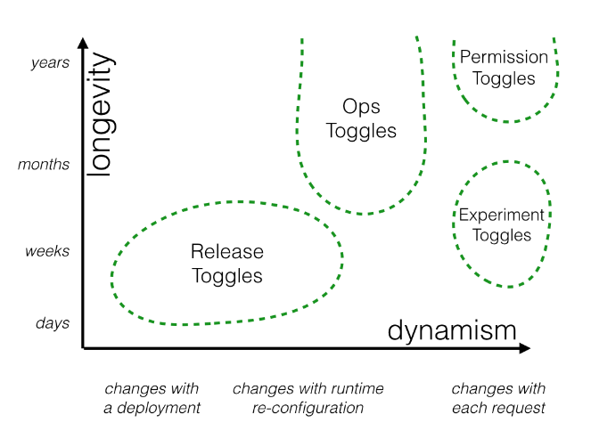

# Feature Toggles

## User story

Your team is responsible for the core simulation engine. You have been tasked with increasing the efficiency of the Spline Reticulation algorithm. You know this will require a fairly large overhaul of the implementation which will take several weeks. Meanwhile other members of your team will need to continue some ongoing work on related areas of the codebase.

the entire team will continue to work on trunk, but the developers working on the Spline Reticulation improvements will use a Feature Toggle to prevent their work from impacting the rest of the team or destabilizing the codebase.

## Birth of Feature Toggle

Before `Feature Toggle`

```js
  function reticulateSplines(){
    // current implementation lives here
  }
these examples all use JavaScript ES2015


```

After:

```js
  function reticulateSplines(){
    var useNewAlgorithm = false;
    // useNewAlgorithm = true; // UNCOMMENT IF YOU ARE WORKING ON THE NEW SR ALGORITHM

    if( useNewAlgorithm ){
      return enhancedSplineReticulation();
    }else{
      return oldFashionedSplineReticulation();
    }
  }

  function oldFashionedSplineReticulation(){
    // current implementation lives here
  }

  function enhancedSplineReticulation(){
    // TODO: implement better SR algorithm
  }

```

## Making a flag dynamic

To test both old algorithm and new algorithm in the same integration test run. They'll need to be able to enable or disable the Feature dynamically, which means it's time to move on from the clunky mechanism of commenting or uncommenting that useNewAlgorithm = true line:

```js
function reticulateSplines(){
  if( featureIsEnabled("use-new-SR-algorithm") ){
    return enhancedSplineReticulation();
  }else{
    return oldFashionedSplineReticulation();
  }
}
```

We've now introduced a `featureIsEnabled` function, a Toggle Router which can be used to dynamically control which codepath is live. There are many ways to implement a Toggle Router, varying from a simple in-memory store to a highly sophisticated distributed system with a fancy UI. For now we'll start with a very simple system:

```js
function createToggleRouter(featureConfig){
  return {
    setFeature(featureName,isEnabled){
      featureConfig[featureName] = isEnabled;
    },
    featureIsEnabled(featureName){
      return featureConfig[featureName];
    }
  };
}
```

We can create a new toggle router based on some default configuration - perhaps read in from a config file - but we can also dynamically toggle a feature on or off. This allows automated tests to verify both sides of a toggled feature:

```js
describe( 'spline reticulation', function(){
  let toggleRouter;
  let simulationEngine;

  beforeEach(function(){
    toggleRouter = createToggleRouter();
    simulationEngine = createSimulationEngine({toggleRouter:toggleRouter});
  });

  it('works correctly with old algorithm', function(){
    // Given
    toggleRouter.setFeature("use-new-SR-algorithm",false);

    // When
    const result = simulationEngine.doSomethingWhichInvolvesSplineReticulation();

    // Then
    verifySplineReticulation(result);
  });

  it('works correctly with new algorithm', function(){
    // Given
    toggleRouter.setFeature("use-new-SR-algorithm",true);

    // When
    const result = simulationEngine.doSomethingWhichInvolvesSplineReticulation();

    // Then
    verifySplineReticulation(result);
  });
});

```

## Getting ready to release

To confirm this they have been modifying their higher-level automated tests so that they exercise the system both with the feature off and with it on. The team also wants to do some manual exploratory testing to ensure everything works as expected - Spline Reticulation is a critical part of the system's behavior, after all.
There are a lot of different approaches to achieve this goal:

* Have the Toggle Router make decisions based on a **Toggle Configuration**, and make that configuration **environment-specific**. Only turn the new feature on in a pre-production environment.
* Allow Toggle Configuration to be modified at runtime via some form of **admin UI**. Use that admin UI to turn the new feature on a test environment.
* Teach the Toggle Router how to make dynamic, **per-request toggling decisions**. These decisions take Toggle Context into account, for example by looking for a **special cookie** or **HTTP header**. Usually Toggle Context is used as a proxy for identifying the user making the request.

## Categories of toggles

Feature toggles can be categorized across two major dimensions:

* how long the feature toggle will live and
* how dynamic the toggling decision must be.
* who will manage the feature toggle,

but I consider longevity and dynamism to be two big factors which can help guide how to manage toggles.

### Release Toggles

These are feature flags used to enable trunk-based development for teams practicing Continuous Delivery

They allow in-progress features to be checked into a shared integration branch (e.g. master or trunk) while still allowing that branch to be deployed to production at any time. Release Toggles allow incomplete and un-tested codepaths to be shipped to production as latent code which may never be turned on.

Product Managers may also use a product-centric version of this same approach to prevent half-complete product features from being exposed to their end users.

Product Managers may have other reasons for not wanting to expose features even if they are fully implemented and tested. Feature release might be being coordinated with a marketing campaign, for example.

Release Toggles are transitionary by nature. They should generally not stick around much longer than a week or two, although product-centric toggles may need to remain in place for a longer period

### Experiment Toggles

Experiment Toggles are used to perform multivariate or A/B testing.Each user of the system is placed into a cohort and at runtime the Toggle Router will consistently send a given user down one codepath or the other, based upon which cohort they are in. By tracking the aggregate behavior of different cohorts we can compare the effect of different codepaths. This technique is commonly used to make data-driven optimizations to things such as the purchase flow of an ecommerce system, or the Call To Action wording on a button.

An Experiment Toggle needs to remain in place with the same configuration long enough to generate statistically significant results. Depending on traffic patterns that might mean a lifetime of hours or weeks. Longer is unlikely to be useful, as other changes to the system risk invalidating the results of the experiment. By their nature Experiment Toggles are highly dynamic - each incoming request is likely on behalf of a different user and thus might be routed differently than the last

### Ops Toggles

These flags are used to control operational aspects of our system's behavior. We might introduce an Ops Toggle when rolling out a new feature which has unclear performance implications so that system operators can disable or degrade that feature quickly in production if needed.

Most Ops Toggles will be relatively short-lived - once confidence is gained in the operational aspects of a new feature the flag should be retired

### Permissioning Toggles

These flags are used to change the features or product experience that certain users receive.For example we may have a set of "premium" features which we only toggle on for our paying customers. Or perhaps we have a set of "alpha" features which are only available to internal users and another set of "beta" features which are only available to internal users plus beta users. I refer to this technique of turning on new features for a set of internal or beta users as a Champagne Brunch - an early opportunity to "drink your own champagne".



### Managing different categories of toggles

#### static vs dynamic toggles

Toggles which are making runtime routing decisions necessarily need more sophisticated Toggle Routers, along with more complex configuration for those routers.

For simple static routing decisions a toggle configuration can be a simple On or Off for each feature with a toggle router which is just responsible for relaying that static on/off state to the Toggle Point. As we discussed earlier, other categories of toggle are more dynamic and demand more sophisticated toggle routers.For example the router for an Experiment Toggle makes routing decisions dynamically for a given user, perhaps using some sort of consistent cohorting algorithm based on that user's id. Rather than reading a static toggle state from configuration this toggle router will instead need to read some sort of cohort configuration defining things like how large the experimental cohort and control cohort should be. That configuration would be used as an input into the cohorting algorithm.

#### Long-lived toggles vs transient toggles

We can also divide our toggle categories into those which are essentially transient in nature vs. those which are long-lived and may be in place for years. This distinction should have a strong influence on our approach to implementing a feature's Toggle Points. If we're adding a Release Toggle which will be removed in a few days time then we can probably get away with a Toggle Point which does a simple if/else check on a Toggle Router. This is what we did with our spline reticulation example earlier:

However if we're creating a new Permissioning Toggle with Toggle Points which we expect to stick around for a very long time then we certainly don't want to implement those Toggle Points by sprinkling if/else checks around indiscriminately. We'll need to use more maintainable implementation techniques.

## Implementation Techniques

### De-coupling decision points from decision logic

One common mistake with Feature Toggles is to couple the place where a toggling decision is made (the Toggle Point) with the logic behind the decision (the Toggle Router)

Whenever we want to modify the logic of that specific toggling decision we have a single place to go. We might want to modify the scope of the decision

* for example which specific feature flag controls the decision. Alternatively we might need to modify the reason for the decision - from being driven by a static toggle configuration to being driven by an A/B experiment, or by an operational concern such as an outage in some of our order cancellation infrastructure.

### Inversion of Decision

As feature flagging has a tendency to become more and more prevalent in a system over time we will see more and more modules becoming coupled to the feature flagging system as a global dependency. Not the ideal scenario.

In software design we can often solve these coupling issues by applying Inversion of Control.

### Avoiding conditionals

our Toggle Point has been implemented using an if statement. This might make sense for a simple, short-lived toggle. However point conditionals are not advised anywhere where a feature will require several Toggle Points, or where you expect the Toggle Point to be long-lived. A more maintainable alternative is to implement alternative codepaths using some sort of Strategy pattern

## Toggle Configuration

### Dynamic routing vs dynamic configuration

Earlier we divided feature flags into those whose toggle routing decisions are essentially static for a given code deployment vs those whose decisions vary dynamically at runtime. It's important to note that there are two ways in which a flag's decisions might change at runtime. Firstly, something like a Ops Toggle might be dynamically re-configured from On to Off in response to a system outage. Secondly, some categories of toggles such as Permissioning Toggles and Experiment Toggles make a dynamic routing decision for each request based on some request context such as which user is making the request. The former is dynamic via re-configuration, while the later is inherently dynamic. These inherently dynamic toggles may make highly dynamic decisions but still have a configuration which is quite static, perhaps only changeable via re-deployment. Experiment Toggles are an example of this type of feature flag - we don't really need to be able to modify the parameters of an experiment at runtime. In fact doing so would likely make the experiment statistically invalid.

### Prefer static configuration

Managing toggle configuration via source control and re-deployments is preferable, if the nature of the feature flag allows it. Managing toggle configuration via source control gives us the same benefits that we get by using source control for things like infrastructure as code. It can allows toggle configuration to live alongside the codebase being toggled, which provides a really big win: toggle configuration will move through your Continuous Delivery pipeline in the exact same way as a code change or an infrastructure change would. This enables the full the benefits of CD - repeatable builds which are verified in a consistent way across environments. It also greatly reduces the testing burden of feature flags. There is less need to verify how the release will perform with both a toggle Off and On, since that state is baked into the release and won't be changed (for less dynamic flags at least). Another benefit of toggle configuration living side-by-side in source control is that we can easily see the state of the toggle in previous releases, and easily recreate previous releases if needed.

### Approaches for managing toggle configuration

#### Hardcoded Toggle Configuration

The most basic technique - perhaps so basic as to not be considered a Feature Flag - is to simply comment or uncomment blocks of code.

#### Parameterized Toggle Configuration

A simple approach which at least allows feature flags to be re-configured without re-building an app or service is to specify Toggle Configuration via command-line arguments or environment variables.
This is a simple and time-honored approach to toggling which has been around since well before anyone referred to the technique as Feature Toggling or Feature Flagging. However it comes with limitations. It can become unwieldy to coordinate configuration across a large number of processes, and changes to a toggle's configuration require either a re-deploy or at the very least a process restart (and probably privileged access to servers by the person re-configuring the toggle too).

#### Toggle Configuration File

Another option is to read Toggle Configuration from some sort of structured file. It's quite common for this approach to Toggle Configuration to begin life as one part of a more general application configuration file.

With a Toggle Configuration file you can now re-configure a feature flag by simply changing that file rather than re-building application code itself. However, although you don't need to re-build your app to toggle a feature in most cases you'll probably still need to perform a re-deploy in order to re-configure a flag.

#### Toggle Configuration in App DB

In response to this many organizations move Toggle Configuration into some type of centralized store, often an existing application DB. This is usually accompanied by the build-out of some form of admin UI which allows system operators, testers and product managers to view and modify Features Flags and their configuration

#### Distributed Toggle Configuration

However nowadays there are a breed of special-purpose hierarchical key-value stores which are a better fit for managing application configuration - services like Zookeeper, etcd, or Consul. These services form a distributed cluster which provides a shared source of environmental configuration for all nodes attached to the cluster. Configuration can be modified dynamically whenever required, and all nodes in the cluster are automatically informed of the change - a very handy bonus feature. Managing Toggle Configuration using these systems means we can have Toggle Routers on each and every node in a fleet making decisions based on Toggle Configuration which is coordinated across the entire fleet.

Some of these systems (such as Consul) come with an admin UI which provides a basic way to manage Toggle Configuration. However at some point a small custom app for administering toggle config is usually created.

#### Overriding configuration

So far our discussion has assumed that all configuration is provided by a singular mechanism. The reality for many systems is more sophisticated, with overriding layers of configuration coming from various sources. With Toggle Configuration it's quite common to have a default configuration along with environment-specific overrides. Those overrides may come from something as simple as an additional configuration file or something sophisticated like a Zookeeper cluster. Be aware that any environment-specific overriding runs counter to the Continuous Delivery ideal of having the exact same bits and configuration flow all the way through your delivery pipeline. Often pragmatism dictates that some environment-specific overrides are used, but striving to keep both your deployable units and your configuration as environment-agnostic as possible will lead to a simpler, safer pipeline. We'll re-visit this topic shortly when we talk about testing a feature toggled system.

##### Per-request overrides

An alternative approach to a environment-specific configuration overrides is to allow a toggle's On/Off state to be overridden on a per-request basis by way of a special cookie, query parameter, or HTTP header. This has a few advantages over a full configuration override. If a service is load-balanced you can still be confident that the override will be applied no matter which service instance you are hitting. You can also override feature flags in a production environment without affecting other users, and you're less likely to accidentally leave an override in place. If the per-request override mechanism uses persistent cookies then someone testing your system can configure their own custom set of toggle overrides which will remain consistently applied in their browser.

The downside of this per-request approach is that it introduces a risk that curious or malicious end-users may modify feature toggle state themselves. Some organizations may be uncomfortable with the idea that some unreleased features may be publicly accessible to a sufficiently determined party. Cryptographically signing your override configuration is one option to alleviate this concern, but regardless this approach will increase the complexity - and attack surface - of your feature toggling system.

## Working with feature-flagged systems

### 　Expose current feature toggle configuration

It's always been a helpful practice to embed build/version numbers into a deployed artifact and expose that metadata somewhere so that a dev, tester or operator can find out what specific code is running in a given environment. The same idea should be applied with feature flags. Any system using feature flags should expose some way for an operator to discover the current state of the toggle configuration. In an HTTP-oriented SOA system this is often accomplished via some sort of metadata API endpoint or endpoints. See for example Spring Boot's Actuator endpoints.

### Take advantage of structured Toggle Configuration files

It's typical to store base Toggle Configuration in some sort of structured, human-readable file (often in YAML format) managed via source-control. There are some additional benefits we can derive from this file. Including a human-readable description for each toggle is surprisingly useful, particularly for toggles managed by folks other than the core delivery team. What would you prefer to see when trying to decide whether to enable an Ops toggle during a production outage event: basic-rec-algo or "Use a simplistic recommendation algorithm. This is fast and produces less load on backend systems, but is way less accurate than our standard algorithm."? Some teams also opt to include additional metadata in their toggle configuration files such as a creation date, a primary developer contact, or even an expiration date for toggles which are intended to be short lived.

### Manage different toggles differently

As discussed earlier, there are various categories of Feature Toggles with different characteristics. These differences should be embraced, and different toggles managed in different ways, even if all the various toggles might be controlled using the same technical machinery.

However from a feature flag management perspective these transitions absolutely should have an impact. As part of transitioning from Release Toggle to an Experiment Toggle the way the toggle is configured will change, and likely move to a different area - perhaps into an Admin UI rather than a yaml file in source control. Product folks will likely now manage the configuration rather than developers. Likewise, the transition from Experiment Toggle to Ops Toggle will mean another change in how the toggle is configured, where that configuration lives, and who manages the configuration.

### Feature Toggles introduce validation complexity

With feature-flagged systems our Continuous Delivery process becomes more complex, particularly in regard to testing. We'll often need to test multiple codepaths for the same artifact as it moves through a CD pipeline. To illustrate why, imagine we are shipping a system which can either use a new optimized tax calculation algorithm if a toggle is on, or otherwise continue to use our existing algorithm. At the time that a given deployable artifact is moving through our CD pipeline we can't know whether the toggle will at some point be turned On or Off in production - that's the whole point of feature flags after all. Therefore in order to validate all codepaths which may end up live in production we must perform test our artifact in both states: with the toggle flipped On and flipped Off.

### Where to place your toggle

#### Toggles at the edge

For categories of toggle which need per-request context (Experiment Toggles, Permissioning Toggles) it makes sense to place Toggle Points in the edge services of your system - i.e. the publicly exposed web apps that present functionality to end users. This is where your user's individual requests first enter your domain and thus where your Toggle Router has the most context available to make toggling decisions based on the user and their request. A side-benefit of placing Toggle Points at the edge of your system is that it keeps fiddly conditional toggling logic out of the core of your system.

#### Toggles in the core

There are other types of lower-level toggle which must be placed deeper within your architecture. These toggles are usually technical in nature, and control how some functionality is implemented internally. An example would be a Release Toggle which controls whether to use a new piece of caching infrastructure in front of a third-party API or just route requests directly to that API. Localizing these toggling decisions within the service whose functionality is being toggled is the only sensible option in these cases

### Managing the carrying cost of Feature Toggles

Feature Flags have a tendency to multiply rapidly, particularly when first introduced. They are useful and cheap to create and so often a lot are created. However toggles do come with a carrying cost. They require you to introduce new abstractions or conditional logic into your code. They also introduce a significant testing burden. Knight Capital Group's $460 million dollar mistake serves as a cautionary tale on what can go wrong when you don't manage your feature flags correctly (amongst other things).

Savvy teams view the Feature Toggles in their codebase as inventory which comes with a carrying cost and seek to keep that inventory as low as possible. In order to keep the number of feature flags manageable a team must be proactive in removing feature flags that are no longer needed. Some teams have a rule of always adding a toggle removal task onto the team's backlog whenever a Release Toggle is first introduced. Other teams put "expiration dates" on their toggles. Some go as far as creating "time bombs" which will fail a test (or even refuse to start an application!) if a feature flag is still around after its expiration date. We can also apply a Lean approach to reducing inventory, placing a limit on the number of feature flags a system is allowed to have at any one time. Once that limit is reached if someone wants to add a new toggle they will first need to do the work to remove an existing flag.

## Acknowledgements

* [https://www.martinfowler.com/articles/feature-toggles.html](https://www.martinfowler.com/articles/feature-toggles.html)
