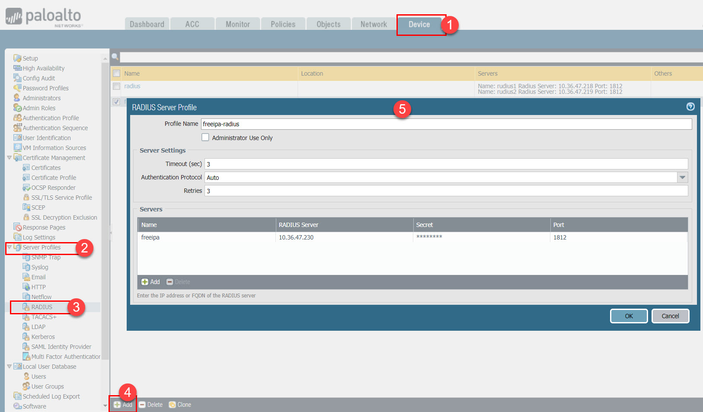
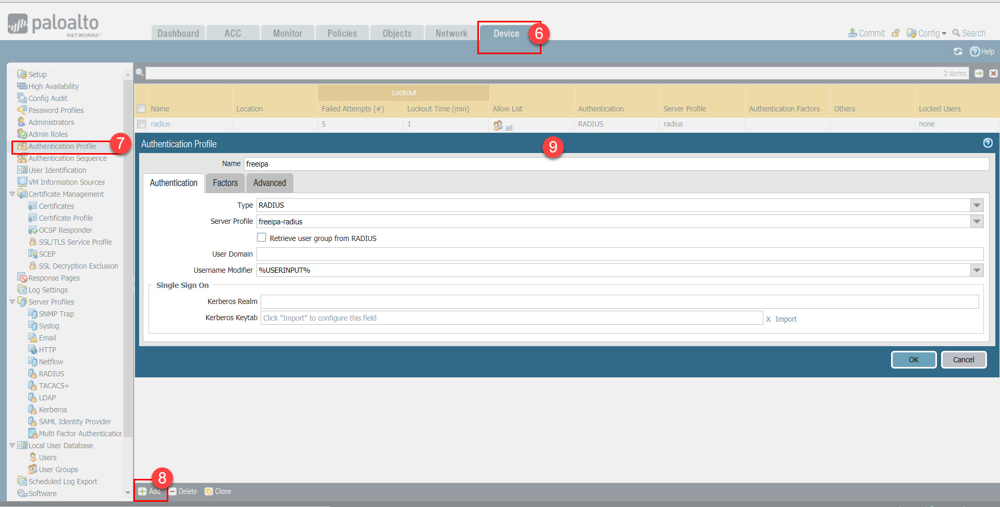
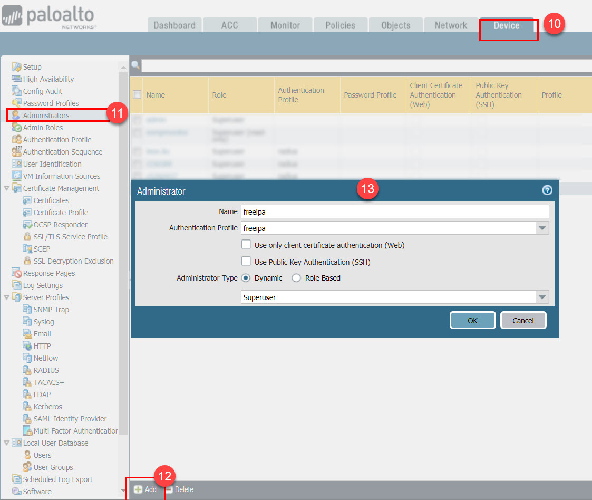

Install freeipa and integrated with freeradius
---
# Prepration: 
| Type   | hostname                                | IP Address   |
|--------|-----------------------------------------|--------------|
| Server |  dc1-oob-vm-freeipa-prod01.hqxywl.com   | 10.36.47.230 |
| Server |  dc1-oob-vm-freeipa-client-prod01.hqxywl.com   | 10.36.47.231 |
| Client |  dc1-oob-vm-ipaclient-prod01.hqxywl.com | 10.36.47.232 
| domain |  hqxywl.com |-|
| Realm  |  HQXYWL.COM |-|
| OS     | CentOS Linux release 7.6.1810 (Core) |-|
| FreeIPA|ipa-server-4.6.4-10.el7.centos.2.x86_64|-|

At this stage, 

# Configuration

- [1. Install package](#1-install-package)
- [2. Install freeipa](#2-install-freeipa)
- [3. Check ldap users](#3-check-ldap-users)
- [4. Configure freeradius](#4-configure-freeradius)
- [5. Configure firewalld](#5-configure-firewalld)
- [6. Add test user in Freeipa](#6-add-test-user-in-freeipa)
- [7. Test with otp login to freeipa portal](#7-test-with-otp-login-to-freeipa-portal)
- [8. Test user with radius](#7-test-user-with-radius)
- [9. Create sudo rule and add user to this sudo rule](#9-create-sudo-rule-and-add-user-to-this-sudo-rule)
- [10. Create hostenrolluser used for adding host into ipa servrer](#10-create-hostenrolluser-used-for-adding-host-into-ipa-servrer)
- [11. Configure ipa-client on client server](#11-configure-ipa-client-on-client-server)
- [12. Test user login and sudo switch to root on client server](#12-test-user-login-and-sudo-switch-to-root-on-client-server)
## 1. Install package
```sh
yum install -y ipa-server bind bind-dyndb-ldap ipa-server-dns
```
## 2. Install FreeIPA
**Make sure password don't contain special character**
```sh
# ipa-server-install -a Devops2019  -p Devops2019 -r INB.HQXYWL.COM -n inb.hqxywl.com  --setup-dns --allow-zone-overlap  --no-reverse  --no-host-dns --forwarder 114.114.114.114 --forwarder 223.5.5.5 --forwarder 119.29.29.29 --mkhomedir -U
```


## 3. Check LDAP Users

to find out the the default base_dn used in `radius`, which is `cn=users,cn=accounts,dc=hqxywl,dc=com`
```sh
ldapsearch -x -v -W -D 'cn=Directory Manager'  uid=admin
```


## 4. Configure FreeRadius
- install radius 
```sh
# yum install freeradius freeradius-utils freeradius-ldap freeradius-krb5
```
- Edit /etc/raddb/clients.conf,modified following items:
    - ipaddr 
    - secret

  Full contenf of `/etc/raddb/clients.conf`
    ```conf
    client localhost {
      ipaddr = 10.36.0.0/16
      proto = *
      secret = SapSecrts
      require_message_authenticator = no
      limit {
        max_connections = 16
        lifetime = 0
        idle_timeout = 30
      }
    }
    ...
    ```

    Edit  /etc/raddb/mods-enabled/ldap
    only modified 
    - server
    - identity
    - password
    - base_dn

    Full content of /etc/raddb/mods-enabled/ldap
    ```conf
    ldap {
      server = '10.36.47.230'
      identity = 'cn=Directory Manager'
      password = 'Devops2019'
      base_dn = 'cn=users,cn=accounts,dc=hqxywl,dc=com'
      sasl {
      }
    ...
    ```

- Edit /etc/raddb/sites-enabled/default, modify following items
  
  - replace  
    ```conf
    -ldap
    ```
      
     with 

    ```conf
    ldap
          if ((ok || updated) && User-Password) {
              update {
                  control:Auth-Type := ldap
              }
          }
    ```
  - umcomment
      ```conf
      #  Auth-Type LDAP {
      #    ldap
      #  }
      ```
      to

      ```conf
        Auth-Type LDAP {
          ldap
        }    
      ```


- Edit /etc/raddb/sites-enabled/inner-tunnel, modify following items

    - replace 
      ```
      -ldap
      ```
      with 
      ```
      ldap
            if ((ok || updated) && User-Password) {
                update {
                    control:Auth-Type := ldap
                }
            }
      ```
    - umcomment
      ```
      #Auth-Type LDAP {
      #  ldap
      #}
      ```
      to 
      ```
      Auth-Type LDAP {
        ldap
      }
     ```     


## 5 Configure firewalld 
  ```
  firewall-cmd --add-service=http   --add-service=https --add-service=ldap --add-service=ldaps --add-service=dns  --add-service=kerberos --add-service=ntp    --add-service=radius   --permanent 
  firewall-cmd --reload
  ```

## 6. Add test user in FreeIPA 
  We can add user in ipa web portal or add it via command line
  also we can add OTP(2FA) to this user

  ```sh
  ipa user-add --first=Jennings --last=Liu --shell=/bin/bash   --sshpubkey=<Public key string> --password jenningsl
  Password: 
  Enter Password again to verify: 
  -------------------
  Added user "jenningsl"
  -------------------
    User login: jenningsl
    First name: jennings
    Last name: liu
    Home directory: /home/jenningsl
    Login shell: /bin/bash
    Principal name: jenningsl@HQXYWL.COM
    Principal alias: jenningsl@HQXYWL.COM
    Email address: jennings.liu@sap.com
    UID: 352200001
    GID: 352200001
    SSH public key fingerprint: SHA256:9kX8nRmXzq7dc5ckwStN78i4RORoeBtLoASr+Ky1TMw jenningsl@workstation.lmy.com (ssh-rsa)
    Account disabled: False
    Password: True
    Member of groups: ipausers
    Member of Sudo rule: admin
    Kerberos keys available: True
  ```

  then we can initialize a login, add will ask you to reset password as first login. after first login we can add otp to this user

  Step 1:
  

  Step 2:
  


  Step 3:
  

  then you can use mobile APP `Google Authenticator` or `FreeOTP` to scan this QR
## 7. Test with otp login to freeipa portal, use password+OTP key to login


## 8. Test user with radius 
  ```shell
  # radtest jenningsl Jennings853800 10.36.47.230 1812 SapSecrts
    Sent Access-Request Id 204 from 0.0.0.0:51736 to 10.36.47.230:1812 length 79
      User-Name = "jenningsl"
      User-Password = "Jennings853800"
      NAS-IP-Address = 10.36.47.230
      NAS-Port = 1812
      Message-Authenticator = 0x00
      Cleartext-Password = "Jennings853800"
    Received Access-Accept Id 204 from 10.36.47.230:1812 to 0.0.0.0:0 length 20
  ```  

## 9. Create sudo rule and add user to this sudo rule 
  ```shell
  # ipa sudorule-add --cmdcat=all --hostcat=all --runasusercat=all --runasgroupcat=all admin
  # ipa sudorule-add-user --users=jenningsl admin
  ```
## 10. Create hostenrolluser used for adding host into ipa servrer 
```
# ipa user-add  --first=hostenrolluser --last=system  --homedir=/home/hostenrolluser  hostenrolluser
---------------------------
Added user "hostenrolluser"
---------------------------
  User login: hostenrolluser
  First name: hostenrolluser
  Last name: system
  Full name: hostenrolluser system
  Display name: hostenrolluser system
  Initials: hs
  Home directory: /home/hostenrolluser
  GECOS: hostenrolluser system
  Login shell: /bin/bash
  Principal name: hostenrolluser@OOB.HQXYWL.COM
  Principal alias: hostenrolluser@OOB.HQXYWL.COM
  Email address: hostenrolluser@sap.com
  UID: 352200011
  GID: 352200011
  Password: False
  Member of groups: ipausers
  Kerberos keys available: False
# ipa passwd hostenrolluser
New Password:
Enter New Password again to verify:
------------------------------------------------
Changed password for "hostenrolluser@HQXYWL.COM"
------------------------------------------------

# ipa role-add --desc="HostEnrollRole" HostEnrollRole
---------------------------
Added role "HostEnrollRole"
---------------------------
  Role name: HostEnrollRole
  Description: HostEnrollRole


# ipa role-add-member --users=hostenrolluser HostEnrollRole
  Role name: HostEnrollRole
  Description: HostEnrollRole
  Member users: hostenrolluser
-------------------------
Number of members added 1
-------------------------
#  ipa role-add-privilege  HostEnrollRole --privileges='Host Enrollment'
  Role name: HostEnrollRole
  Description: HostEnrollRole
  Member users: hostenrolluser
  Privileges: Host Enrollment
----------------------------
Number of privileges added 1
----------------------------
```

## 11. Configure ipa-client on client server 

  ```sh
  # yum install -y ipa-client nscd nss-pam-ldapd
  # ipa-client-install --domain=hqxywl.com --realm=HQXYWL.COM --server=dc1-oob-vm-freeipa-prod01.hqxywl.com  --mkhomedir -p hostenrolluser -w password  -U
  WARNING: ntpd time&date synchronization service will not be configured as
  conflicting service (chronyd) is enabled
  Use --force-ntpd option to disable it and force configuration of ntpd

  Client hostname: dc1-oob-vm-freeipa-client-prod01.hqxywl.com
  Realm: HQXYWL.COM
  DNS Domain: hqxywl.com
  IPA Server: dc1-oob-vm-freeipa-prod01.hqxywl.com
  BaseDN: dc=hqxywl,dc=com

  Skipping synchronizing time with NTP server.
  Successfully retrieved CA cert
      Subject:     CN=Certificate Authority,O=HQXYWL.COM
      Issuer:      CN=Certificate Authority,O=HQXYWL.COM
      Valid From:  2019-03-14 06:57:03
      Valid Until: 2039-03-14 06:57:03

  Enrolled in IPA realm HQXYWL.COM
  Created /etc/ipa/default.conf
  New SSSD config will be created
  Configured sudoers in /etc/nsswitch.conf
  Configured /etc/sssd/sssd.conf
  Configured /etc/krb5.conf for IPA realm HQXYWL.COM
  trying https://dc1-oob-vm-freeipa-prod01.hqxywl.com/ipa/json
  [try 1]: Forwarding 'schema' to json server 'https://dc1-oob-vm-freeipa-prod01.hqxywl.com/ipa/json'
  trying https://dc1-oob-vm-freeipa-prod01.hqxywl.com/ipa/session/json
  [try 1]: Forwarding 'ping' to json server 'https://dc1-oob-vm-freeipa-prod01.hqxywl.com/ipa/session/json'
  [try 1]: Forwarding 'ca_is_enabled' to json server 'https://dc1-oob-vm-freeipa-prod01.hqxywl.com/ipa/session/json'
  Systemwide CA database updated.
  Hostname (dc1-oob-vm-freeipa-client-prod01.hqxywl.com) does not have A/AAAA record.
  Missing reverse record(s) for address(es): 10.36.47.231.
  Adding SSH public key from /etc/ssh/ssh_host_rsa_key.pub
  Adding SSH public key from /etc/ssh/ssh_host_ecdsa_key.pub
  Adding SSH public key from /etc/ssh/ssh_host_ed25519_key.pub
  [try 1]: Forwarding 'host_mod' to json server 'https://dc1-oob-vm-freeipa-prod01.hqxywl.com/ipa/session/json'
  SSSD enabled
  Configured /etc/openldap/ldap.conf
  Configured /etc/ssh/ssh_config
  Configured /etc/ssh/sshd_config
  Configuring hqxywl.com as NIS domain.
  Client configuration complete.
  The ipa-client-install command was successful
  ```
  > shoud modiy /etc/resolv.conf to set `10.36.47.230` as the first dns server
  
   if user home is not automatically created, excute following command to update 
  ```sh
  # authconfig --update --enablemkhomedir
  ```
## 12. Test user login and sudo switch to root on client server
```sh
[jenningsl@workstation ]$ ssh 10.36.47.232
Creating home directory for jenningsl.
Last failed login: Thu Mar 14 21:55:58 CST 2019 from 10.36.52.232 on ssh:notty
There was 1 failed login attempt since the last successful login.
[jenningsl@dc1-oob-vm-freeipa-client-prod01 ~]$ pwd
/home/jenningsl
[jenningsl@dc1-oob-vm-freeipa-client-prod01 ~]$ id
uid=352200001(jenningsl) gid=352200001(jenningsl) groups=352200001(jenningsl)
[jenningsl@dc1-oob-vm-freeipa-client-prod01 ~]$ sudo -i

We trust you have received the usual lecture from the local System
Administrator. It usually boils down to these three things:

    #1) Respect the privacy of others.
    #2) Think before you type.
    #3) With great power comes great responsibility.

First Factor: 
Second Factor: 
[root@dc1-oob-vm-freeipa-client-prod01 ~]# 
```

## 13. Integrated with PaloAlto Firewall
PA info
| Type   | hostname                                | IP Address   |
|--------|-----------------------------------------|--------------|
| Model |	PA-3020|
| Software Version|	8.0.13|
| GlobalProtect Agent	|0.0.0|
| Application Version	|8134-5351 (03/14/19)|
| Threat Version	|8134-5351 (03/14/19)|
| Antivirus Version	|2924-3434 (03/21/19)|
| WildFire Version	|333381-336058 (03/22/19)|
| URL Filtering Version|	20190322.20092|


### 13.1 Create `Radius Server Profile`   
    
  


### 13.2 Create `Authentication Profile` which unitilize  newly created  `Radius Server Profile`   

  


### 13.3 Create Administrator mapping to newly created Ahtentication Profile 

  


then commit the changes to the firewall, now we can use the users defined in `FreeIPA` to logon PA.