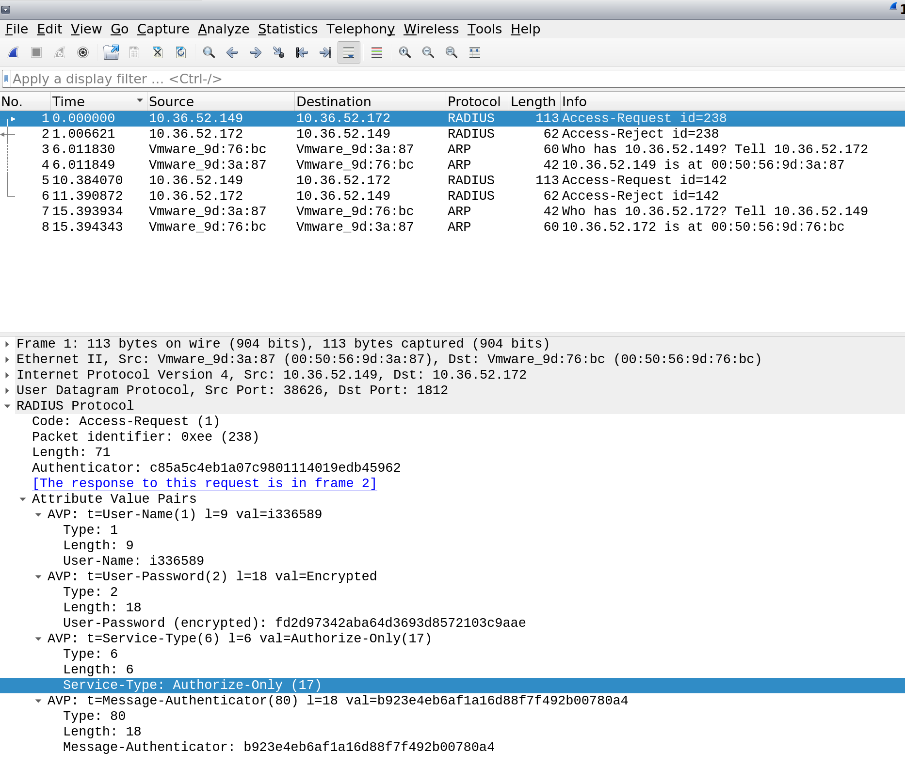
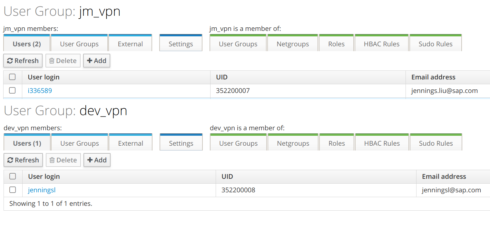
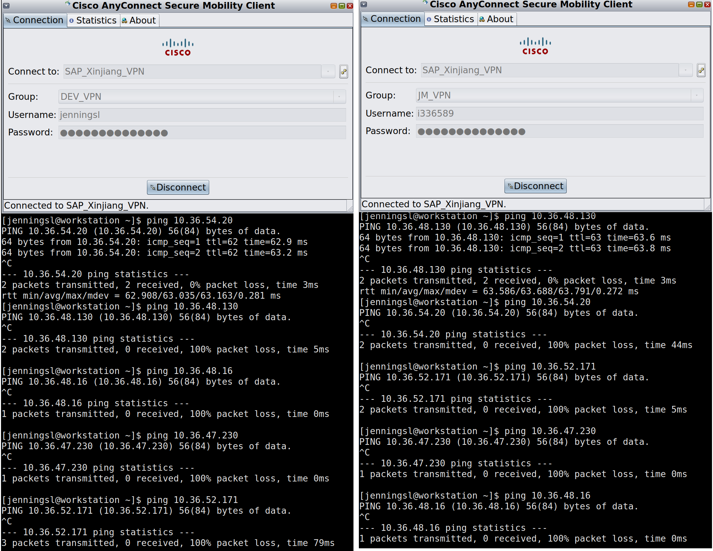

Install freeipa and integrated with freeradius
---
# Prepration: 
| Type   | hostname                                | IP Address   |
|--------|-----------------------------------------|--------------|
| Server | dc1-vm-freeipa-prod01.inb.hqxywl.com  |10.36.52.172 |
| Server |   dc1-vm-freeipa-prod02.inb.hqxywl.com  | 10.36.52.173|
| domain |  inb.hqxywl.com |-|
| Realm  |  INB.HQXYWL.COM |-|
| OS     | CentOS Linux release 7.6.1810 (Core) |-|
| FreeIPA|ipa-server-4.6.4-10.el7.centos.2.x86_64|-|

At this stage, 

# Configuration

- [1. Install package](#1-install-package)
- [2. Install freeipa](#2-install-freeipa)
- [3. Check ldap users](#3-check-ldap-users)
- [4. Configure freeradius](#4-configure-freeradius)
- [5. Configure firewalld](#5-configure-firewalld)
- [6. Add test user in Freeipa](#6-add-test-user-in-freeipa)
- [7. Test with otp login to freeipa portal](#7-test-with-otp-login-to-freeipa-portal)
- [8. Test user with radius](#7-test-user-with-radius)
- [9. Create sudo rule and add user to this sudo rule](#9-create-sudo-rule-and-add-user-to-this-sudo-rule)
- [10. Create hostenrolluser used for adding host into ipa servrer](#10-create-hostenrolluser-used-for-adding-host-into-ipa-servrer)
- [11. Configure ipa-client on client server](#11-configure-ipa-client-on-client-server)
- [12. Test user login and sudo switch to root on client server](#12-test-user-login-and-sudo-switch-to-root-on-client-server)
- [13. Integrated with PaloAlto Firewall](#13-integrated-with-paloalto-firewall)
- [14. Integrated with nginx ](#14-integrate-with-nginx)
- [15. Integrate with Cisco Switch](#15-integrate-with-cisco-switch)
- [16. Integrate with Cisco ASA VPN ](#16-integrate-with-cisco-asa-vpn)
- [17. Install replica](#17-Install-replica)
## 1. Install package
```sh
yum install -y ipa-server bind bind-dyndb-ldap ipa-server-dns
```
## 2. Install FreeIPA
**Make sure password don't contain special character**
```sh
#ipa-server-install -a Devops2019  -p Devops2019 -r INB.HQXYWL.COM -n inb.hqxywl.com  --setup-dns --allow-zone-overlap  --reverse-zone=36.10.in-addr.arpa. --no-host-dns --forwarder 114.114.114.114 --forwarder 223.5.5.5 --forwarder 119.29.29.29 --mkhomedir -U 

```

Enable DNS PTR update 
```
# ipa dnszone-mod inb.hqxywl.com. --allow-sync-ptr=TRUE
# ipa dnsconfig-mod --allow-sync-ptr=TRUE
```
link： https://docs.pagure.org/bind-dyndb-ldap/BIND9/SyncPTR.html
## 3. Check LDAP Users

to find out the the default base_dn used in `radius`, which is `cn=users,cn=accounts,dc=inb,dc=hqxywl,dc=com`
```sh
ldapsearch -x -v -W -D 'cn=Directory Manager'  uid=admin
```


## 4. Configure FreeRadius
- install radius 
```sh
# yum install freeradius freeradius-utils freeradius-ldap freeradius-krb5
```
- Edit /etc/raddb/clients.conf,modified following items:
    - ipaddr 
    - secret

  Full contenf of `/etc/raddb/clients.conf`
    ```conf
    client localnet {
      ipaddr = 10.36.0.0/16
      proto = *
      secret = SapSecrts
      require_message_authenticator = no
      nas_type         = other
      limit {
        max_connections = 16
        lifetime = 0
        idle_timeout = 30
      }
    }
    ...
    ```

    Edit  /etc/raddb/mods-enabled/ldap
    only modified 
    - server
    - identity
    - password
    - base_dn

    Full content of /etc/raddb/mods-enabled/ldap
    ```conf
    ldap {
      server = 'localhost'
      identity = 'cn=Directory Manager'
      password = 'Devops2019'
      base_dn = 'cn=users,cn=accounts,dc=inb,dc=hqxywl,dc=com'
      sasl {
      }
    ...
    ```

- Edit /etc/raddb/sites-enabled/default, modify following items
  
  - in section `authorize`, replace   
    ```conf
    authorize {
      ...
      -ldap
      ...
    }
    ```
      
     with 

    ```conf
    authorize {
      ...
      ldap
            if ((ok || updated) && User-Password) {
                update {
                    control:Auth-Type := ldap
                }
            }
      ...
    }
    ```
  - in section `authenticate`, umcomment
      ```conf
      authenticate {
        ...
        
        #  Auth-Type LDAP {
        #    ldap
        #  }
        ...
      }
      ```
      to

      ```conf
      authenticate {
        ...
        Auth-Type LDAP {
          ldap
        }    
        ...

      }
      ```


- Edit /etc/raddb/sites-enabled/inner-tunnel, modify following items

    - in section `authorize`, replace 
      ```
      authorize {
        ...
        -ldap
        ...
      }
      ```
      with 
      ```
      authorize {
        ...
        ldap
              if ((ok || updated) && User-Password) {
                  update {
                      control:Auth-Type := ldap
                  }
              }
        ...
      }
      ```
    - in section `authenticate`, umcomment
      ```
      authenticate {
        ...
        #Auth-Type LDAP {
        #  ldap
        #}
        ...
      }
      ```
      to 
      ```
      Auth-Type LDAP {
        ldap
      }
     ```     

- Edit `/etc/raddb/mods-config/preprocess/hints` and/or  `/etc/raddb/mods-config/preprocess/huntgroups` to preprocess the request from clients, which will be process within   directive `preprocess` of section `authorize` in each site files


## 5 Configure firewalld 
  ```
  firewall-cmd --add-service=http   --add-service=https --add-service=ldap --add-service=ldaps --add-service=dns  --add-service=kerberos --add-service=kpasswd --add-service=ntp    --add-service=radius   --permanent 
  firewall-cmd --reload
  ```

## 6. Add test user in FreeIPA 
  We can add user in ipa web portal or add it via command line
  also we can add OTP(2FA) to this user

  ```sh
  ipa user-add --first=Jennings --last=Liu --shell=/bin/bash   --sshpubkey=<Public key string> --password jenningsl
  Password: 
  Enter Password again to verify: 
  -------------------
  Added user "jenningsl"
  -------------------
    User login: jenningsl
    First name: jennings
    Last name: liu
    Home directory: /home/jenningsl
    Login shell: /bin/bash
    Principal name: jenningsl@INB.HQXYWL.COM
    Principal alias: jenningsl@INB.HQXYWL.COM
    Email address: jennings.liu@sap.com
    UID: 352200001
    GID: 352200001
    SSH public key fingerprint: SHA256:9kX8nRmXzq7dc5ckwStN78i4RORoeBtLoASr+Ky1TMw jenningsl@workstation.lmy.com (ssh-rsa)
    Account disabled: False
    Password: True
    Member of groups: ipausers
    Member of Sudo rule: admin
    Kerberos keys available: True
  ```

  then we can initialize a login, add will ask you to reset password as first login. after first login we can add otp to this user

  Step 1:
  

  Step 2:
  


  Step 3:
  

  then you can use mobile APP `Google Authenticator` or `FreeOTP` to scan this QR
## 7. Test with otp login to freeipa portal, use password+OTP key to login


## 8. Test user with radius 
  ```shell
  # radtest jenningsl Jennings853800 10.36.47.230 1812 SapSecrts
    Sent Access-Request Id 204 from 0.0.0.0:51736 to 10.36.47.230:1812 length 79
      User-Name = "jenningsl"
      User-Password = "Jennings853800"
      NAS-IP-Address = 10.36.47.230
      NAS-Port = 1812
      Message-Authenticator = 0x00
      Cleartext-Password = "Jennings853800"
    Received Access-Accept Id 204 from 10.36.47.230:1812 to 0.0.0.0:0 length 20
  ```  

## 9. Create sudo rule and add user to this sudo rule 
  ```shell
  # ipa sudorule-add --cmdcat=all --hostcat=all --runasusercat=all --runasgroupcat=all admin
  # ipa sudorule-add-user --users=jenningsl admin
  ```
## 10. Create hostenrolluser used for adding host into ipa servrer 
```
# ipa user-add  --first=hostenrolluser --last=system  --homedir=/home/hostenrolluser  hostenrolluser
---------------------------
Added user "hostenrolluser"
---------------------------
  User login: hostenrolluser
  First name: hostenrolluser
  Last name: system
  Full name: hostenrolluser system
  Display name: hostenrolluser system
  Initials: hs
  Home directory: /home/hostenrolluser
  GECOS: hostenrolluser system
  Login shell: /bin/bash
  Principal name: hostenrolluser@INB.HQXYWL.COM
  Principal alias: hostenrolluser@INB.HQXYWL.COM
  Email address: hostenrolluser@sap.com
  UID: 352200011
  GID: 352200011
  Password: False
  Member of groups: ipausers
  Kerberos keys available: False
# ipa passwd hostenrolluser
New Password:
Enter New Password again to verify:
------------------------------------------------
Changed password for "hostenrolluser@HQXYWL.COM"
------------------------------------------------

# ipa role-add --desc="HostEnrollRole" HostEnrollRole
---------------------------
Added role "HostEnrollRole"
---------------------------
  Role name: HostEnrollRole
  Description: HostEnrollRole


# ipa role-add-member --users=hostenrolluser HostEnrollRole
  Role name: HostEnrollRole
  Description: HostEnrollRole
  Member users: hostenrolluser
-------------------------
Number of members added 1
-------------------------
#  ipa role-add-privilege  HostEnrollRole --privileges='Host Enrollment'
  Role name: HostEnrollRole
  Description: HostEnrollRole
  Member users: hostenrolluser
  Privileges: Host Enrollment
----------------------------
Number of privileges added 1
----------------------------


# ipa privilege-add-permission "Host Enrollment" --permissions="System: Add Hosts"
  Privilege name: Host Enrollment
  Description: Host Enrollment
  Permissions: System: Add Hosts, System: Add krbPrincipalName to a Host, System: Enroll a Host, System: Manage Host Certificates, System: Manage Host Enrollment Password, System: Manage
               Host Keytab, System: Manage Host Principals
  Granting privilege to roles: Enrollment Administrator, HostEnrollRole
-----------------------------
Number of permissions added 1
-----------------------------
```

## 11. Configure ipa-client on client server 

  ```sh
  # yum install -y ipa-client nscd nss-pam-ldapd
  # ipa-client-install --domain=inb.hqxywl.com --realm=INB.HQXYWL.COM --server=dc1-vm-freeipa-prod01.inb.hqxywl.com  --mkhomedir -p hostenrolluser -w password  -U

  ```
  > shoud modiy /etc/resolv.conf to set `10.36.52.172` as the first dns server
  
   if user home is not automatically created, excute following command to update 
  ```sh
  # authconfig --update --enablemkhomedir
  ```
## 12. Test user login and sudo switch to root on client server
```sh
[jenningsl@workstation ]$ ssh 10.36.47.232
Creating home directory for jenningsl.
Last failed login: Thu Mar 14 21:55:58 CST 2019 from 10.36.52.232 on ssh:notty
There was 1 failed login attempt since the last successful login.
[jenningsl@dc1-oob-vm-freeipa-client-prod01 ~]$ pwd
/home/jenningsl
[jenningsl@dc1-oob-vm-freeipa-client-prod01 ~]$ id
uid=352200001(jenningsl) gid=352200001(jenningsl) groups=352200001(jenningsl)
[jenningsl@dc1-oob-vm-freeipa-client-prod01 ~]$ sudo -i

We trust you have received the usual lecture from the local System
Administrator. It usually boils down to these three things:

    #1) Respect the privacy of others.
    #2) Think before you type.
    #3) With great power comes great responsibility.

First Factor: 
Second Factor: 
[root@dc1-oob-vm-freeipa-client-prod01 ~]# 
```

## 13. Integrated with PaloAlto Firewall
PA info
| Type   | hostname                                | IP Address   |
|--------|-----------------------------------------|--------------|
| Model |	PA-3020|
| Software Version|	8.0.13|
| GlobalProtect Agent	|0.0.0|
| Application Version	|8134-5351 (03/14/19)|
| Threat Version	|8134-5351 (03/14/19)|
| Antivirus Version	|2924-3434 (03/21/19)|
| WildFire Version	|333381-336058 (03/22/19)|
| URL Filtering Version|	20190322.20092|


### 13.1 Create `Radius Server Profile`   
    
  


### 13.2 Create `Authentication Profile` which unitilize  newly created  `Radius Server Profile`   

  


### 13.3 Create Administrator mapping to newly created Ahtentication Profile 

  


then commit the changes to the firewall, now we can use the users defined in `FreeIPA` to logon PA.


## 14. Integrate with nginx 

### 14.1  Integrated nginx with FreeIPA via ldap 

- Prequisites
  1. nginx compiled with [nginx-auth-ldap](https://github.com/kvspb/nginx-auth-ldap)
- add ldap bind user  
```sh
# cat nginx.update
dn: uid=nginx,cn=sysaccounts,cn=etc,dc=hqxywl,dc=com
add:objectclass:account
add:objectclass:simplesecurityobject
add:uid:nginx
add:userPassword:nginx
add:passwordExpirationTime:20380119031407Z
add:nsIdleTimeout:0

# ipa-ldap-updater nginx.update
Update complete
The ipa-ldap-updater command was successful
```
- configure nginx , add configure 
```conf
   ldap_server 389_ds_1 {
      # user search base.
      url "ldap://10.36.52.172:389/DC=inb,DC=hqxywl,DC=com?uid?sub?(objectClass=*)";
      # bind as
      binddn "uid=nginx,cn=sysaccounts,cn=etc,dc=inb,dc=hqxywl,dc=com";
      # bind pw
      binddn_passwd "nginx";
      # group attribute name which contains member object
      group_attribute member;
      #group_attribute memberuid;
      # search for full DN in member object
      group_attribute_is_dn on;
      # matching algorithm (any / all)
      #satisfy any;
      # list of allowed groups
      #require group "CN=Admins,OU=My Security Groups,DC=company,DC=com";
      # list of allowed users
      # require 'valid_user' cannot be used together with 'user' as valid user is a superset
      require valid_user;
      ssl_check_cert off;
    }
```
- configure vhost 
```conf
....
server {
    listen       9090;
    server_name  default;

    auth_ldap "Forbidden";
    auth_ldap_servers 389_ds_1;

    location /  {
      proxy_http_version   1.1;
      proxy_hide_header    Vary;
      proxy_hide_header    X-Powered-By;
      proxy_set_header     Host             $host;
      proxy_set_header     X-Real_IP        $remote_addr;
      proxy_set_header     X-Forwarded-For  $proxy_add_x_forwarded_for;
      proxy_next_upstream  http_502 http_504 http_404 error timeout invalid_header;
      proxy_pass           http://prometheus_upstream;
    }
}

....
```

### 14.2 Integrate nginx with FreeIPA via radius
#### 14.2.1  Configure clients for nginx 
- add client conf for vpn, add following lines to `/etc/raddb/clients.conf`
```conf
  client nginx {
        ipaddr = 10.36.52.149
        proto = *
        secret = SapSecrets
        appname = nginx
        require_message_authenticator = no
        nas_type         = other
        limit {
                max_connections = 16
                lifetime = 0
                idle_timeout = 30
        }
  }
```
> to distinguish each client, add a label `appname` to each client
#### 14.2.2  Configure post auth for vpn  in freeradius.

modify `/etc/raddb/sites-enabled/default`, at  `post-auth` section, add following lines
```conf

    if ("%{client:appname}" == "nginx") {
        update reply {
                Service-Type = "Authorize-Only"
                }
    }
```
> 1. nginx use [nginx-http-radius-module](https://github.com/qudreams/nginx-http-radius-module)
> 2. Tried many times, still failed to login 
> 3. Finally, I use tcpdump to capture the data between nginx and freeradius, from it, I get the  service type of the request is `Authorize-Only`, so here set `Service-Type` to `Authorize-Only` 
           




#### 14.2.3  Confiugre radius in nginx
- Configure nginx , add configure 
```conf
        #set the directory of radius dictionary.
        radius_dict_directory "/etc/nginx/raddb/";

        #radius server configuration including

        radius_server "radius_server1" {
            #authentication timed-out
            auth_timeout 5;

            #limit to resend the request
            resend_limit 3;

            #radius authentication server url.
            url "10.36.52.172:1812";

            #share secret
            share_secret "SapSecrets";
        }


```
- configure vhost 
```conf
....
server {
    listen       9090;
    server_name  default;

    location /  {
      proxy_http_version   1.1;
      proxy_hide_header    Vary;
      proxy_hide_header    X-Powered-By;
      proxy_set_header     Host             $host;
      proxy_set_header     X-Real_IP        $remote_addr;
      proxy_set_header     X-Forwarded-For  $proxy_add_x_forwarded_for;
      proxy_next_upstream  http_502 http_504 http_404 error timeout invalid_header;
      proxy_pass           http://prometheus_upstream;
      
      auth_radius_server "radius_server1" "PAP";
      auth_radius "Restricted";

    }
}

....
```


## 15. Integrate with Cisco Switch

No special conf for switches on FreeIPA side, just defines the client in FreeRadius

## 16. Integrate with Cisco ASA VPN 
### 16.1 configure clients in freeradius
- add client conf for vpn, add following lines to `/etc/raddb/clients.conf`
  ```conf
  client vpn {
    ipaddr = 10.36.48.2
    proto = *
    secret = SapSecrets
    nas_type = cisco
    appname = vpn
    require_message_authenticator = no

  }

  ```
  > Cisco devices `nas_type` can be set to `cisco`, 
  > to distinguish each client, add a label `appname` to each client
### 16.2 configure post auth for vpn  in freeradius  
  
LDAP mapped users-To map LDAP attributes, see the ldap attribute-map command.
    RADIUS users-Use the IETF RADIUS numeric service-type attribute, which maps to one of the following values:

  -  Service-Type 5 (Outbound) denies management access. The user cannot use any services specified by the aaa authentication console commands (excluding the serial keyword; serial access is allowed). Remote access (IPsec and SSL) users can still authenticate and terminate their remote access sessions.

  -  Service-Type 6 (Administrative) allows full access to any services specified by the aaa authentication console commands.

  -  Service-Type 7 (NAS prompt) allows access to the CLI when you configure the aaa authentication { telnet | ssh} console command, but denies ASDM configuration access if you configure the aaa authentication http console command. ASDM monitoring access is allowed. If you configure enable authentication with the aaa authentication enable console command, the user cannot access privileged EXEC mode using the enable command.


So if we want login to ASA console,     set `Service-Type` to `Administrative-User`, if we want to login as VPN accesss, `Service-Type` to `Outbound-User`.

- modify `/etc/raddb/sites-enabled/default`, at  `post-auth` section, add following lines
  ```conf
  {
  ...

  post-auth {
  
  ....

    ldap
      if ("%{client:appname}" == "vpn") {
        if (LDAP-Group == "jm_vpn" ) {
            update reply {
                Service-Type = "Outbound-User",
                ASA-Group-Policy = "OU=JM_VPN"
                }
         }
        elsif ( LDAP-Group == "dev_vpn") {
            update reply {
                Service-Type = "Outbound-User",
                ASA-Group-Policy = "OU=DEV_VPN"
                }
         }
      }

      
  ....
    }
  
  ...
  }
  ```
  > Notes:
  > 1. [Freeradius wiki page](http://wiki.freeradius.org/modules/Rlm_ldap) says  this should be   configured in `raddb/mods-available/ldap`, but for freeradius-3.0.13-9.el7_5.x86_64 on centos7, it will display error 
   `/etc/raddb/mods-enabled/ldap[413]: Invalid location for 'if'`
   `Errors reading or parsing /etc/raddb/radiusd.conf`
    so we shoud configure it at /etc/raddb/sites-enabled/default
  > 2. To restrict user to have specific permission, we need to map  Group-Policy betwwen ASA and freeradius, so we need to add attribute `ASA-Group-Policy` in this section too. we can get all attributes from `/usr/share/freeradius/dictionary.cisco.asa`     
    ```sh
       grep -i policy /usr/share/freeradius/dictionary.cisco.asa
       ATTRIBUTE	ASA-Group-Policy			25	string
    ```
  > 3. Configuration for ` Group-Policy` and other attributes are  listed  https://www.cisco.com/c/en/us/td/docs/security/asa/asa912/configuration/general/asa-912-general-config/aaa-radius.html

  > 4. also we can here add reply based on some runtime attributes and vaules
    ```
    %{Attribute-Name}               The value of the given Attribute-Name in the request packet                                  
    %{request:Attribute-Name}       The value of value the given Attribute-Name in the request packet                                  
    %{reply:Attribute-Name}         The value of the given Attribute-Name in the reply packet                                  
    %{proxy-request:Attribute-Name} The value of the given Attribute-Name in the proxy request packet (if it exists)
    %{proxy-reply:Attribute-Name}   The value of the given Attribute-Name in the proxy reply packet (if it exists)
                                    
    ```     
    e.g , we can use `%{request:ASA_ClientType}` at `post-auth` to reply based on request of vpn autentication request, since only VPN authentication request have `ASA_` prefix attribitutes in the requests   

  ```
   if ("%{request:ASA_ClientType}" == 2) {
        if (LDAP-Group == "jm_vpn" ) {
            update reply {
                Service-Type = "Outbound-User",
                ASA-Group-Policy = "OU=JM_VPN"
                }
         }
        elsif ( LDAP-Group == "dev_vpn") {
            update reply {
                Service-Type = "Outbound-User",
                ASA-Group-Policy = "OU=DEV_VPN"
                }
         }
      }
  ```
  or simply evaluate if the attribute exist
  ```
     if (ASA_ClientType) {
        if (LDAP-Group == "jm_vpn" ) {
            update reply {
                Service-Type = "Outbound-User",
                ASA-Group-Policy = "OU=JM_VPN"
                }
         }
        elsif ( LDAP-Group == "dev_vpn") {
            update reply {
                Service-Type = "Outbound-User",
                ASA-Group-Policy = "OU=DEV_VPN"
                }
         }
      }
  ```
### 16.3 Restart FreeRadius
```sh
systemctl restart radiusd
```

### 16.4 Create group `JM_VPN` and `DEV_VPN` , add user into two groups

### 16.4 Test VPN login

Login with `Cisco Anyconnect Secure Mobility Client` with different user to have test, now user in group `JM_VPN` or `DEV_VPN` can login with VPN access with different privileges, but others don't have VPN access 




> DEV_VPN can only access dev vlan(10.36.54.0/25), others don't
> JM_VPN can only access jumpserver address 10.36.48.130, others don't
> users in group `dev_vpn` can only login vpn vith VPN group `DEV_VPN`
> users in group `jm_vpn` can only login vpn vith VPN group `JM_VPN`


## 17  Install replica
Update /etc/resolv.conf, add 10.36.52.172 as the first DNS server. 


### 17.1 Configure firewalld 
```
#firewall-cmd --add-service=http   --add-service=https --add-service=ldap --add-service=ldaps --add-service=dns  --add-service=kerberos --add-service=kpasswd --add-service=ntp    --add-service=radius   --permanent 
# firewall-cmd --reload
```
### 17.2 install packages
```
# yum install -y ipa-server bind bind-dyndb-ldap ipa-server-dns
```
### 17.3 Configure replica and ca on this slave 
```

# ipa-replica-install  -w Devops2019 -U --mkhomedir   --setup-ca   --setup-dns --allow-zone-overlap  --reverse-zone=36.10.in-addr.arpa.  --forwarder 114.114.114.114 --forwarder 223.5.5.5 --forwarder 119.29.29.29 --force-join
```

if install failed, we need to remove this repica on the master node via 
```
ipa-replica-manage del dc1-vm-freeipa-prod02.inb.hqxywl.com --force
```
### 18 DNS records managements
18.1 add record 
```
ipa dnsrecord-add  inb.hqxywl.com www --a-rec 10.1.1.1  --a-create-reverse
```

18.2 modify record
```
ipa dnsrecord-mod inb.hqxywl.com www --a-rec 10.1.1.1 
```
