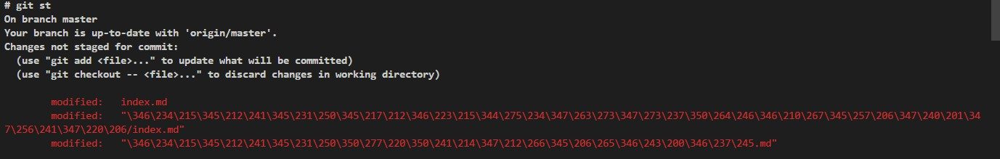
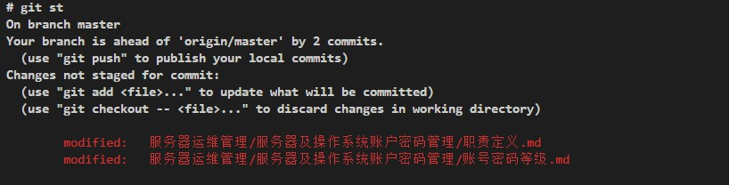

# github 
1. download source with commit ID
    ```
    curl -SLO https://github.com/ukui/ukui-power-manager/archive/f937de93f7c83e68176c3d04355068b66fccdf1f.tar.gz 
    ```


# git commands
1. git status can display chinese path.
 
    Error shows as following image:

    

    from https://stackoverflow.com/questions/4144417/how-to-handle-asian-characters-in-file-names-in-git-on-os-x
    ```
    Git quotes any non-ascii character by default, not only asian ones. There's an option to disable this quoting behaviour.

    You can disable it using the following command:

    git config --global core.quotepath false
    Or, alternatively, by adding the following snippet to your git config file ($HOME/.gitconfig usually)

    [core]
        quotepath = false
    After this, git should show your filenames exactly as they are.
    ```
    
    after configure `quotepath`, it can display chinese path correctly.
    

2. Delete the branches
- delete remote branch 
``` sh
    # git push origin --delete dev
    To git@github.com:jenningsloy318/regex.git
     - [deleted]         dev
```
- delete local branch

    **Though remote branch is deleted, but local copy still exists**
    - check the status
    ``` sh
        # git st
                On branch dev
                nothing to commit, working directory clean
    ```
    -  delete local copy
    ``` sh
        # git br -D dev
                Deleted branch dev (was 0514697).
    ```
    - check if the branch is still existing
    ``` sh
        # git  co dev
                error: pathspec 'dev' did not match any file(s) known to git.
    ```        

3. to push to a different branch 

```
#git branch
  master
  rel-1.0.0
* rel-1.0.5
# git push origin HEAD:refs/for/rel-1.0.5
```


4. Reverse the file to the clean state
- Modified a file, and not staged via git add 
    - check the status
    ```sh
    # git status
    On branch master
    Your branch is up-to-date with 'origin/master'.
    
    Changes not staged for commit:
      (use "git add <file>..." to update what will be committed)
      (use "git checkout -- <file>..." to discard changes in working directory)
    
            modified:   notes.md
    
    no changes added to commit (use "git add" and/or "git commit -a")
    ```
    - just checkout this file, it will discard the changes.
    ``` sh
    # git checkout notes.md
    ```
    - now check the status again
    ```sh
    # git status
    On branch master
    Your branch is up-to-date with 'origin/master'.
    
    nothing to commit, working directory clean
    ```
- Modified a file, and staged it via git add, but not committed
    - edit the file
    ```sh
    # vim notes.md
    ```
    - check the status
    ```sh
    # git status
    On branch master
    Your branch is up-to-date with 'origin/master'.
    
    Changes not staged for commit:
      (use "git add <file>..." to update what will be committed)
        (use "git checkout -- <file>..." to discard changes in working directory)
    
                modified:   notes.md
    
                no changes added to commit (use "git add" and/or "git commit -a")
    ```
    - stage the file
    ```sh
    # git add notes.md
    ```
    - check the status again
    ```sh
    # git status
                On branch master
                Your branch is up-to-date with 'origin/master'.
    
                Changes to be committed:
                  (use "git reset HEAD <file>..." to unstage)
    
                          modified:   notes.md
    
    ```
    - reset to its HEAD
    ```sh
    # git reset HEAD notes.md
    Unstaged changes after reset:
    M       notes.md
    ```
    - checkout the file, and then the changes are discarded.
    ```sh
    # git checkout notes.md
    ```
    - finally check the stauts of the file
    ```sh
    # git status
    On branch master
    Your branch is up-to-date with 'origin/master'.
    
    nothing to commit, working directory clean
    ```
- Modified a file, and staged it via git add,committed  but not pushed
    - edit the file
    ```sh
    # vim notes.md
    ```
    - check the status
    ```sh
    # git status
    On branch master
    Your branch is up-to-date with 'origin/master'.
    
    Changes not staged for commit:
      (use "git add <file>..." to update what will be committed)
        (use "git checkout -- <file>..." to discard changes in working directory)
    
                modified:   notes.md
    
                no changes added to commit (use "git add" and/or "git commit -a")
    ```
    - stage the file
    ```sh
    # git add notes.md
    ```
    - commit the file
    ```sh
    # git commit  -m "modify the command"
                    [master 20bdb03] modify the command
                     1 file changed, 1 insertion(+)
    ```
    - reset the file (to previous commit)
    ```sh
    # git reset notes.md 
    or
    #git reset  0514697f242dd5ea5577f5e223fb7cd2da9716fa 
    ```
    - checkout the file, and then the changes are discarded
    ```sh
    # git checkout notes.md
    # git status
                     On branch master
                     Your branch is ahead of 'origin/master' by 1 commit.
                       (use "git push" to publish your local commits)
    
                       nothing to commit, working directory clean
    ```
- Modified a file, and staged it via git add,committed,pushed, revert to the previously commit
    - edit the file
    ```sh
    # vim notes.md
    ```
    - check the status
    ```sh
    # git status
    On branch master
    Your branch is up-to-date with 'origin/master'.
    
    Changes not staged for commit:
      (use "git add <file>..." to update what will be committed)
        (use "git checkout -- <file>..." to discard changes in working directory)
    
                modified:   notes.md
    
                no changes added to commit (use "git add" and/or "git commit -a")
    ```
    - stage the file
    ```sh
    # git add notes.md
    ```
    - commit the file
    ```sh
    # git commit  -m "modify the command"
                    [master 20bdb03] modify the command
                     1 file changed, 1 insertion(+)
    ```
    - push the changes
    ```sh
    # git push

    Counting objects: 5, done.
    Delta compression using up to 4 threads.
    Compressing objects: 100% (2/2), done.
    Writing objects: 100% (3/3), 288 bytes | 0 bytes/s, done.
    Total 3 (delta 1), reused 0 (delta 0)
    remote: Resolving deltas: 100% (1/1), completed with 1 local objects.
    To git@github.com:jenningsloy318/regex.git
       0514697..20bdb03  master -> master
    ```
    - check the commit log
    ```sh
    # git log
    commit 20bdb03fd6ea82f2b4aee8b96b14df6075778d42
    Author: Jennings Liu <jennings.liu@sap.com>
    Date:   Fri Dec 2 13:15:13 2016 +0800

        modify the command

        commit 0514697f242dd5ea5577f5e223fb7cd2da9716fa
        Author: root <root@CTUN50947963A.dhcp.ctul.sap.corp>
        Date:   Thu Dec 1 09:37:06 2016 +0800

            adjust the format of md again
    ```
    - reset to commit 0514697f242dd5ea5577f5e223fb7cd2da9716fa
    ```sh
    # git reset 0514697f242dd5ea5577f5e223fb7cd2da9716fa
        Unstaged changes after reset:
        M       notes.md
    ```
    - force push to remote
    ```sh
    # git push -f
        Total 0 (delta 0), reused 0 (delta 0)
        To git@github.com:jenningsloy318/regex.git
        + 20bdb03...0514697 master -> master (forced update)
    ```
    - check the commit log again
    ```sh
    # git log
         commit 0514697f242dd5ea5577f5e223fb7cd2da9716fa
         Author: root <root@CTUN50947963A.dhcp.ctul.sap.corp>
         Date:   Thu Dec 1 09:37:06 2016 +0800
    
             adjust the format of md again
    ```
    - check the status
    ```sh

    # git status
    On branch master
    Your branch is up-to-date with 'origin/master'.
    
    Changes not staged for commit:
      (use "git add <file>..." to update what will be committed)
      (use "git checkout -- <file>..." to discard changes in working directory)
    
            modified:   notes.md
    
    no changes added to commit (use "git add" and/or "git commit -a")
    ```
    - finally reset and checkout the file to discard the changes
    ```sh
    # git reset HEAD  notes.md
        Unstaged changes after reset:
        M       notes.md
    # git checkout notes.md
    ```
    - check the status
    ```sh
    # git status
        On branch master
        Your branch is up-to-date with 'origin/master'.
        
        nothing to commit, working directory clean
    ```


---

Notes:

1. build git latest rpm package
    a. clone code
    ```
    git clone https://src.fedoraproject.org/rpms/git.git

    ```

    copy git.spec to ~/rpmbuild/SPECS, and other files to ~/rpmbuild/SOURCES

    download `git-version.tar.xz` and `git-version.tar.sign` from  https://mirrors.edge.kernel.org/pub/software/scm/git/
    
    b. install dependency packages
    - centos7/rhel7
        ```
        yum install -y asciidoc xmlto emacs expat-devel libcurl-devel pcre2-devel tcl tk cvs cvsps highlight httpd mod_dav_svn perl-CGI-Carp perl-CGI-Util perl-IO-Pty perl-JSON-PP perl-Test-More subversion-perl libsecret-devel perl-IO-Pty-Easy.noarch perl-MailTools.noarch   perl-Test-Output  perl-CGI.noarch  perl-JSON.noarch epel-rpm-macros 
        ```
    - on centos8/rhel8 
        ```
        dnf install apr-util-bdb desktop-file-utils emacs  expat-devel gcc glibc-langpack-en glibc-langpack-is highlight httpd libcurl-devel  libsecret-devel make mod_dav_svn openssl-devel  pcre2-devel bash-completion  python3-devel subversion  subversion-perl tcl time tk zlib-devel   perl-generators asciidoc xmlto  perl-Memoize perl-Time-HiRes perl-DBD-SQLite   perl-JSON perl-IO-All perl-IO perl-JSON-PP  perl-JSON perl-Test-Output perl-Test perl-IO-Tty perl-MailTools  -y
        ```
    c. build with  
    ```
    rpmbuild -bb git.spec --nocheck --without docs
    ```