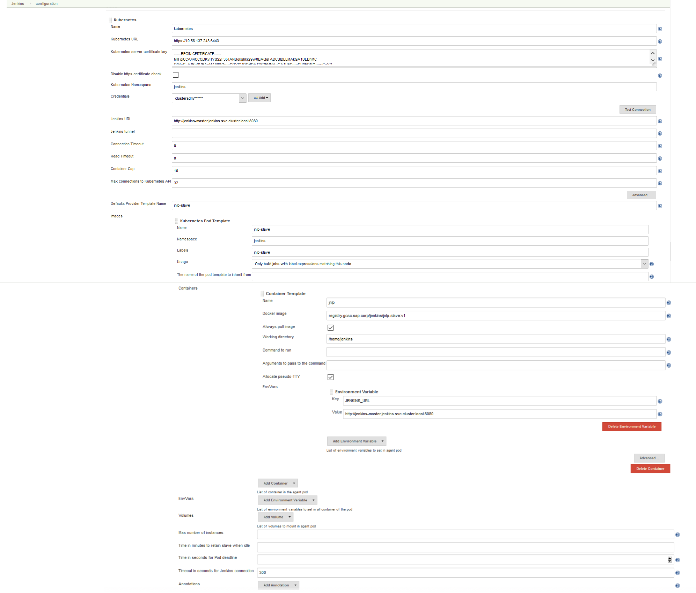

1. Configure Global Security

    if we use AD for authentication, we can set set following two parameters in order to accelerate the access speed.
    
    
    - `Remove irrelevant groups`
    - `Enable cache` and `Cache TTL`
2. integration with kubernetes
    
    2.1 build with pipeline
    - prequisites
        * install kubernetes-plugin in jenkins master
        * configure the Kubernetes plugin
        ```       
        Home Page >> Manage Jenkins >> Configure System >> Configure the following:         
            # of executors: 0
            Add a new cloud >> Kubernetes
            Name: kubernetes
            Kubernetes URL: https://xx.xx.xx.xx:6443
            Kubernetes Namespace: jenkins
            Kubernetes server certificate key:  [ X509 PEM encoded certificate ]
            Jenkins URL: http://jenkins-master.jenkins.svc.cluster.local:8080         
        ```
        
        
    - Create the test pipeline Jenkins job,       then edit the job, Scroll down to the Pipeline area, paste in the script below and click Save:

        - work with my modified kuberbetes-plugin(1.3.4)

        ```
        podTemplate(
            	name: 'jnlp-slave-pipeline',
            	label: 'jnlp-slave-pipeline', 
            	cloud: 'kubernetes', 
            	nodeSelector: 'cnpvgl56588417',
            	slaveConnectTimeout: 300, 
            	containers: [
            		containerTemplate(
                    name: 'jnlp',
                    image: 'registry.gcsc.sap.corp/jenkins/jnlp-slave:v2',
                    ttyEnabled: true,
                    alwaysPullImage: true,
                    resourceLimitMemory: '4Gi',
                    workingDir: '/home/jenkins',
                    envVars: [
                        envVar(key: 'JENKINS_URL', value:   'http://jenkins-master.jenkins.svc.cluster.local:8080'),
            			envVar(key: 'DOCKER_HOST', value:   'tcp://10.58.137.243:2376'),
            			]
            		)
            	],
            	volumes: []
            )       

            {
                    node('jnlp-slave-pipeline') {
                    
                    stage('prepare') {
        				sh 'sudo curl -SL   http://aia.pki.co.sap.com/aia/SAPNetCA_G2.crt -o  /etc/ssl/certs/SAPNetCA_G2.crt'
        				sh 'sudo sed -i  "100aSAPNetCA_G2.crt"     /etc/ca-certificates.conf'
        				sh 'sudo update-ca-certificates'
        				sh 'sudo cat /etc/ca-certificates.conf|grep -i SAPNetCA_G2'     

                    }
                    stage('clone the source code') {
                        git(
                             url:   'https://github.wdf.sap.corp/csc-devops/Owl.git',
                             branch: 'demo-may-2018'
                            )
                    }
                    stage('build and push docker images') {
                        sh 'mkdir ~/.m2/'
                        sh 'cp -f settings.xml ~/.m2/'
                        sh 'cp -f settings-security.xml  ~/.m2/'
                        sh 'cp -r docker ~/.docker'
        				sh 'npm config set  registry http://nexus.wdf.sap.corp:8081/nexus/repository/build.milestones.npm/'
                        sh 'npm config set strict-ssl false'
                        sh 'npm config set  https-proxy http://proxy.wdf.sap.corp:8080'
                        sh 'mvn clean install -Dmaven.test.skip=true    -Dhttp.proxyHost=proxy   -Dhttp.proxyPort=8080     -Dhttps.proxyHost=proxy   -Dhttps.proxyPort=8080    -Dhttp.nonProxyHosts=10.58.137.243,10.58.137.244'
                    }

                    stage('list pod ') {
                        sh 'kubectl get pod '
                    }
            }
            }
        ```
        - work with my official kubernetes-plugin(1.6)


   **Caution**: when define the container template, be sure set  the container name to **jnlp**, otherwise the pod will create two containers one is jnlp, the other is the one you specify here

    - Now when the build job is running, it will call k8s cluster to spawn new pods based on the podTemplate  to run the build jobs

    2.2  build with  freestyle job, 
    
    * configure the Kubernetes plugin, we also need to configure pod template and container template, also container name must be **jnlp** .
      

    * create freestyle job, to select the node of the pod lable. 
       
