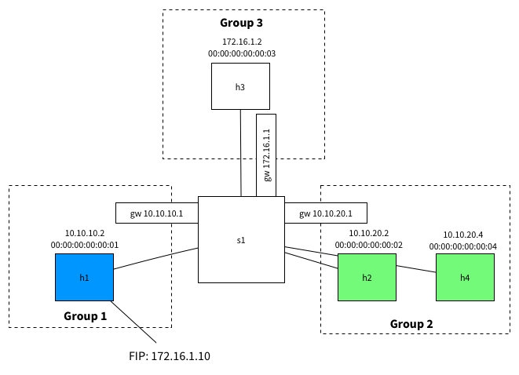
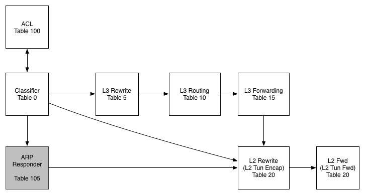

## 1.  Topology



We have a host in an **external** network `172.16.1.0/24`, one host in an **internal** network `10.10.10.0/24` and two hosts in another **internal** network `10.10.20.0/24`.

As such, The hosts in the 10.x.x.x range should be able to speak to each other, but should not be able to speak to external hosts.

The host `10.10.10.2` has a floating IP of `172.16.1.10` and should be reachable on this address from the external `172.16.1.0/24` network. To do this, we'll use `DNAT` for traffic from `172.16.1.2 -> 172.16.1`.10 and `SNAT` for traffic back from `10.10.10.2 -> 172.16.1.2`
## 2. Pipeline


**Table 0 - Classifier**
In this table we work out what traffic is interesting for us before pushing it further along the pipeline

**Table 100 - ACL**
While we don't use this table today, the idea would be to filter traffic in this table (or series of tables) and to then resubmit to the classifier once we have scrubbed them.

**Table 105 - ARP Responder**
In this table we use some OVS-Jitsu to take an incoming ARP Request and turn it in to an ARP reply

**Table 5 - L3 Rewrite**
In this table, we make any L3 modifications we need to before a packet is routed

**Table 10 - L3 Routing**
The L3 routing table is where the routing magic happens. Here we modify the Source MAC address, Decrement the TTL and push to the L2 tables for forwarding

**Table 15 - L3 Forwarding**
In the L3 forwarding table we resolve a destination IP address to the correct MAC address for L2 forwarding.

**Table 20 - L2 Rewrites**
While we aren't using this table in this example, typically we would push/pop any L2 encapsulations here like a VLAN tag or a VXLAN/GRE Tunnel ID.

**Table 25 - L2 Forwarding**
In this table we do our L2 lookup and forward out the correct port. We also handle L2 BUM traffic here using OpenFlow Groups - no VLANs!

## 3. The Flows
```
ovs-vsctl set Bridge s1 "protocols=OpenFlow13"
ovs-ofctl add-group -OOpenFlow13 s1 group_id=1,type=all,bucket=output:1
ovs-ofctl add-group -OOpenFlow13 s1 group_id=2,type=all,bucket=output:2,4
ovs-ofctl add-group -OOpenFlow13 s1 group_id=3,type=all,bucket=output:3
ovs-ofctl add-flow -OOpenFlow13 s1 "table=0, priority=1000, dl_type=0x0806, actions=goto_table=105"
ovs-ofctl add-flow -OOpenFlow13 s1 "table=0, priority=100, dl_dst=00:00:5E:00:02:01, action=goto_table=5"
ovs-ofctl add-flow -OOpenFlow13 s1 "table=0, priority=100, dl_dst=00:00:5E:00:02:02, action=goto_table=5"
ovs-ofctl add-flow -OOpenFlow13 s1 "table=0, priority=100, dl_dst=00:00:5E:00:02:03, action=goto_table=5"
ovs-ofctl add-flow -OOpenFlow13 s1 "table=0, priority=0, action=goto_table=20"
ovs-ofctl add-flow -OOpenFlow13 s1 "table=5, priority=65535, dl_type=0x0800, nw_dst=10.10.10.0/24 actions=goto_table=10"
ovs-ofctl add-flow -OOpenFlow13 s1 "table=5, priority=65535, dl_type=0x0800, nw_dst=10.10.20.0/24 actions=goto_table=10"
ovs-ofctl add-flow -OOpenFlow13 s1 "table=5, priority=100, dl_type=0x0800,  nw_dst=172.16.1.10 actions=mod_nw_dst=10.10.10.2, goto_table=10"
ovs-ofctl add-flow -OOpenFlow13 s1 "table=5, priority=100, dl_type=0x0800,  nw_src=10.10.10.2, actions=mod_nw_src=172.16.1.10,  goto_table=10"
ovs-ofctl add-flow -OOpenFlow13 s1 "table=5, priority=0, actions=goto_table=10"
ovs-ofctl add-flow -OOpenFlow13 s1 "table=10, dl_type=0x0800, nw_dst=10.10.10.0/24, actions=mod_dl_src=00:00:5E:00:02:01, dec_ttl, goto_table=15"
ovs-ofctl add-flow -OOpenFlow13 s1 "table=10, dl_type=0x0800, nw_dst=10.10.20.0/24, actions=mod_dl_src=00:00:5E:00:02:02, dec_ttl, goto_table=15"
ovs-ofctl add-flow -OOpenFlow13 s1 "table=10, dl_type=0x0800, nw_dst=172.16.1.0/24, actions=mod_dl_src=00:00:5E:00:02:03, dec_ttl, goto_table=15"
ovs-ofctl add-flow -OOpenFlow13 s1 "table=10, priority=0, actions=output:0"
ovs-ofctl add-flow -OOpenFlow13 s1 "table=15, dl_type=0x0800, nw_dst=10.10.10.2, actions=mod_dl_dst:00:00:00:00:00:01, goto_table=20"
ovs-ofctl add-flow -OOpenFlow13 s1 "table=15, dl_type=0x0800, nw_dst=10.10.20.2, actions=mod_dl_dst:00:00:00:00:00:02, goto_table=20"
ovs-ofctl add-flow -OOpenFlow13 s1 "table=15, dl_type=0x0800, nw_dst=10.10.20.4, actions=mod_dl_dst:00:00:00:00:00:04, goto_table=20"
ovs-ofctl add-flow -OOpenFlow13 s1 "table=15, dl_type=0x0800, nw_dst=172.16.1.2, actions=mod_dl_dst:00:00:00:00:00:03, goto_table=20"
ovs-ofctl add-flow -OOpenFlow13 s1 "table=15, priority=0, actions=goto_table=20"
 ovs-ofctl add-flow -OOpenFlow13 s1 "table=20, priority=0, actions=goto_table=25"
ovs-ofctl add-flow -OOpenFlow13 s1 "table=25, in_port=1, dl_dst=01:00:00:00:00:00/01:00:00:00:00:00, actions=group=1"
ovs-ofctl add-flow -OOpenFlow13 s1 "table=25, in_port=2, dl_dst=01:00:00:00:00:00/01:00:00:00:00:00, actions=group=2"
ovs-ofctl add-flow -OOpenFlow13 s1 "table=25, in_port=3, dl_dst=01:00:00:00:00:00/01:00:00:00:00:00, actions=group=3"
ovs-ofctl add-flow -OOpenFlow13 s1 "table=25, in_port=4, dl_dst=01:00:00:00:00:00/01:00:00:00:00:00, actions=group=2"
ovs-ofctl add-flow -OOpenFlow13 s1 "table=25, dl_dst=00:00:00:00:00:01,actions=output=1"
ovs-ofctl add-flow -OOpenFlow13 s1 "table=25, dl_dst=00:00:00:00:00:02,actions=output=2"
ovs-ofctl add-flow -OOpenFlow13 s1 "table=25, dl_dst=00:00:00:00:00:03,actions=output=3"
ovs-ofctl add-flow -OOpenFlow13 s1 "table=25, dl_dst=00:00:00:00:00:04,actions=output=4"
ovs-ofctl add-flow -OOpenFlow13 s1 "table=105, dl_type=0x0806, nw_dst=10.10.10.1, actions=move:NXM_OF_ETH_SRC[]->NXM_OF_ETH_DST[], mod_dl_src:00:00:5E:00:02:01, load:0x2->NXM_OF_ARP_OP[], move:NXM_NX_ARP_SHA[]->NXM_NX_ARP_THA[], move:NXM_OF_ARP_SPA[]->NXM_OF_ARP_TPA[], load:0x00005e000201->NXM_NX_ARP_SHA[], load:0x0a0a0a01->NXM_OF_ARP_SPA[], in_port"
ovs-ofctl add-flow -OOpenFlow13 s1 "table=105,  dl_type=0x0806, nw_dst=10.10.20.1, actions=move:NXM_OF_ETH_SRC[]->NXM_OF_ETH_DST[],  mod_dl_src:00:00:5E:00:02:02, load:0x2->NXM_OF_ARP_OP[], move:NXM_NX_ARP_SHA[]->NXM_NX_ARP_THA[], move:NXM_OF_ARP_SPA[]->NXM_OF_ARP_TPA[], load:0x00005e000202->NXM_NX_ARP_SHA[], load:0xa0a1401->NXM_OF_ARP_SPA[], in_port"
ovs-ofctl add-flow -OOpenFlow13 s1 "table=105,  dl_type=0x0806, nw_dst=172.16.1.1, actions=move:NXM_OF_ETH_SRC[]->NXM_OF_ETH_DST[],  mod_dl_src:00:00:5E:00:02:03, load:0x2->NXM_OF_ARP_OP[], move:NXM_NX_ARP_SHA[]->NXM_NX_ARP_THA[], move:NXM_OF_ARP_SPA[]->NXM_OF_ARP_TPA[], load:0x00005e000203->NXM_NX_ARP_SHA[], load:0xac100101->NXM_OF_ARP_SPA[], in_port"
ovs-ofctl add-flow -OOpenFlow13 s1 "table=105, dl_type=0x0806, nw_dst=172.16.1.10, actions=move:NXM_OF_ETH_SRC[]->NXM_OF_ETH_DST[], mod_dl_src:00:00:5E:00:02:03, load:0x2->NXM_OF_ARP_OP[], move:NXM_NX_ARP_SHA[]->NXM_NX_ARP_THA[], move:NXM_OF_ARP_SPA[]->NXM_OF_ARP_TPA[], load:0x00005e000203->NXM_NX_ARP_SHA[], load:0xac10010a->NXM_OF_ARP_SPA[], in_port"
ovs-ofctl add-flow -OOpenFlow13 s1 "table=105, priority=0, action=resubmit(,20)"
```


link:
- https://dtucker.co.uk/building-a-router-with-openvswitch/index.html