Tcpdump/wireshark
---

recently I need to use tool to find the wechat content history of official accounts to print them as html or pdf, previously fiddler is used, but it is a commercial software, so I am thinking to use tcpdump/wireshark to capture the packet and to find the exact URL


## capture and decode http(s) contents
1. prequisities 
   - to decode a https requests and responses, an environment `SSLKEYLOGFILE` to be added to point a file on local machine, whether it is `windows`/`Linux`/`Mac`, acoording to https://support.f5.com/csp/article/K50557518
   - This file is an encryption key log with  text format,these logs are created using a Man in the Middle (MitM) technique when the pcap is originally recorded. If no such file was created when the pcap was recorded, you cannot decrypt HTTPS traffic in that pcap.
  - when access the website while also using tcpdump or wireshark to capture the packets, also this filled with decrypt keys

  > this can not be used when using a proxy to access the website
2. Analyze
   1. using wireshark to open pcap file
   2. specify the ssl key log file, `Edit` --> `Preference` -->`Protocols` --> `TLS`--> `(Pre)Master Secret log file`, use `Browse` to spefify the ssl key log file location, then click `OK`
   3. wireshark window can disply http request headers, requests, ..etc. 
      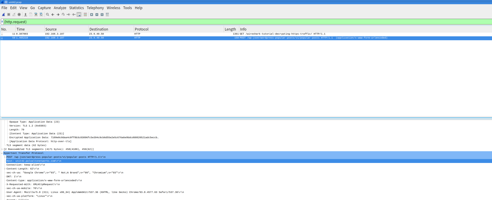

      Here I can see all headers, request URL for further analysis.

3. Some offsets and field values may be expressed as names rather than as numeric values. The following protocol header field offsets are available: `icmptype` (**ICMP type field**), ``icmp6type`` (**ICMPv6 type field**), `icmpcode` (**ICMP code field**), `icmp6code` (**ICMPv6 code field**) and `tcpflags` (**TCP flags field** also called **Control Bits**).
    - The following ICMP type field values are available: icmp-echoreply, icmp-unreach, icmp-sourcequench, icmp-redirect, icmp-echo, icmp-routeradvert, icmp-routersolicit, icmp-timxceed, icmp-paramprob, icmp-tstamp, icmp-tstampreply, icmp-ireq, icmp-ireqreply, icmp-maskreq, icmp-maskreply.

    - The following ICMPv6 type fields are available: icmp6-destinationrunreach, icmp6-packettoobig, icmp6-timeexceeded, icmp6-parameterproblem, icmp6-echo, icmp6-echoreply, icmp6-multicastlistenerquery, icmp6-multicastlistenerreportv1, icmp6-multicastlistenerdone, icmp6-routersolicit, icmp6-routeradvert, icmp6-neighborsolicit, icmp6-neighboradvert, icmp6-redirect, icmp6-routerrenum, icmp6-nodeinformationquery, icmp6-nodeinformationresponse, icmp6-ineighbordiscoverysolicit, icmp6-ineighbordiscoveryadvert, icmp6-multicastlistenerreportv2, icmp6-homeagentdiscoveryrequest, icmp6-homeagentdiscoveryreply, icmp6-mobileprefixsolicit, icmp6-mobileprefixadvert, icmp6-certpathsolicit, icmp6-certpathadvert, icmp6-multicastrouteradvert, icmp6-multicastroutersolicit, icmp6-multicastrouterterm.

    - The following TCP flags field values are available: tcp-fin, tcp-syn, tcp-rst, tcp-push, tcp-ack, tcp-urg, tcp-ece, tcp-cwr.


## Understand network protocol headers and connections
- [Understand IP header](#Understand-IP-header)
- [Understand TCP header](#Understand-TCP-header)
- [Understand UDP header](#Understand-UDP-header)
- [Understand ICMP header](#Understand-ICMP-header)
- [Understand DHCP header](#Understand-DHCP-header)

### Understand IP header
   A typical IP header is 20 bytes(if no tcp Options are set), the option segment is variable from 0 to 40 bytes.
   
- First byte
   - The first half of first byte(Version):
      - if `0100`: `4`: means ipv4
   - The second half of first byte(IHL)
      - if `0101` = `5` in decimal. This is the number of blocks(`word`) of 32 bits in the headers. 5 x 32 bits = 160 bits or 20 bytes.
      - indicates the header lenth
   - to calculate first byte in decimal, `01000101`: is `69`, a typical IPv4 first byte is `69`
   - any value that larger than `69` means
      - ipv4 with IP option set or 
      - ipv6 
   - to filter if we had IP options set
      ```
      tcpdump -i eth1 'ip[0] > 69'
      ```
      > not really, because possiblly it is a ipv6 packet
      - the proper way, "masking" the first half of the byte
          ```
          0100 0101 : 1st byte originally
          0000 1111 : mask
          =========
          0000 0101 : final result
          ```
          >  (0xf in hex or 15 in decimal). 0 will mask the values while 1 will keep the values  intact
          In binary,so it should be
          ```
          # tcpdump -i eth1 'ip[0] & 15 > 5'
          ```
          or in hexadecimal
          ```
          # tcpdump -i eth1 'ip[0] & 0xf > 5'
          
          ```

    - to calculate the lenth of IP header in `words`
      ```
      # tcpdump -i eth1 'ip[0] & 0xf'
      
      ```
      transform to bytes
      ```
      # tcpdump -i eth1 'ip[0] & 0xf <<2'
      
      ```
   - recap
      - keep the last 4 bits intact, use 0xf (binary 00001111)
      - keep the first 4 bits intact, use 0xf0 (binary 11110000)
- 2nd byte
   - Type of Service (ToS) - The 8-bit ToS uses 3 bits for IP Precedence, 4 bits for ToS with the last bit not being used. The 4-bit ToS field, although defined, has never been used.
   - IP Precedence: used to prioritize IP traffic 
      - 000: Routing or Best Effort
      - 001: Priority
      - 010: Immediate
      - 011: Flash
      - 100: Flash Override
      - 101: Critical
      - 110: Internetwork Control
      - 111: Network Contral
   - Type of Service Values
      - 0000: Normal Delvery
      - 0001: Minimize Cost
      - 0010: Maximize Reliability
      - 0100: Maximize Throughput
      - 1000: Minimize Delay
   - Differentiated Services Code Point (DSCP) - A 6-bit field used to identify the level of service a packet receives in the network. DSCP is a 3-bit expansion of IP precedence with the elimination of the ToS bits.
      
      Name |	Value (Binary) |	Value (Decimal) |Reference | equivilant of TOS
      -----|------------------|-------------|----------|----------
      CS0	|000000|	0	|[RFC2474]|Routing
      CS1	|001000|	8	|[RFC2474]|
      CS2	|010000|	16	|[RFC2474]
      CS3	|011000|	24	|[RFC2474]
      CS4	|100000|	32	|[RFC2474]
      CS5	|101000|	40	|[RFC2474]
      CS6	|110000|	48	|[RFC2474]
      CS7	|111000|	56	|[RFC2474]
      AF11	|001010|	10	|[RFC2597]|Priority
      AF12	|001100|	12	|[RFC2597]|Priority
      AF13	|001110|	14	|[RFC2597]|Priority
      AF21	|010010|	18	|[RFC2597]|Immediate
      AF22	|010100|	20	|[RFC2597]|Immediate
      AF23	|010110|	22	|[RFC2597]|Immediate
      AF31	|011010|	26	|[RFC2597]|Flash
      AF32	|011100|	28	|[RFC2597]|Flash
      AF33	|011110|	30	|[RFC2597]|Flash
      AF41	|100010|	34	|[RFC2597]|Flash Override
      AF42	|100100|	36	|[RFC2597]|Flash Override
      AF43	|100110|	38	|[RFC2597]|Flash Override
      EF    |101110|	46	|[RFC3246] |Critical
      VOICE-ADMIT | 101100 |	44|[RFC5865]
- Total Lenth
    Specifies the length of the IP packet that includes the IP header and the user data. The length field is 2 bytes, so the maximum size of an IP packet is 216 – 1 or 65,535 bytes.

    ```
    tcpdump ip[2:2] 
    ```
    will result in the total lenth of the IP packet 

- DF bit (don't fragment) set ?

   check if fragmentation occuring, which is not desirable. Fragmentation occurs 
when a the MTU of the sender is bigger than the path MTU on the path to destination.

   Fragmentation info can be found in the 7th and 8th byte of the IP header.

      +-+-+-+-+-+-+-+-+-+-+-+-+-+-+-+-+
      |Flags|      Fragment Offset    |
      +-+-+-+-+-+-+-+-+-+-+-+-+-+-+-+-+

   - Flags(3 bits)
      - Bit 0: 	reserved, must be zero
      - Bit 1: 	(DF) 0 = May Fragment, 1 = Don't Fragment.
      - Bit 2: 	(MF) 0 = Last Fragment, 1 = More Fragments.
   - Fragment Offset
      - only used when fragmentation occurs.

   - If we want to match the DF bit (don't fragment bit, to avoid IP fragmentation) :

      The 7th byte would have a value of :
      `01000000` or `64` in decimal
      ```
      # tcpdump -i eth1 'ip[6] = 64'
      ```
   - Matching fragmentation ?
      - if this is not the last fragment, so more gragments,`00100000` is `32`
         ```
         tcpdump -i eth1 'ip[6] = 32'
      - if it is the last fragment, 
         - first 3 bits are 0, but the fragment data may not, so the tail `5` bits should not zero, 
         - also the whole byte can't be `64` as it already has fragment
         ```
          tcpdump -i eth1 '((ip[6:2]>0) and (not ip[6]=64))'
          ```
          > - `ip[6:2]` is starting to filter 7th byte for 2 bytes, that is 7th and 8th byte

- Matching datagrams with low TTL
   - The TTL field is located in the 9th byte and fits perfectly into 1 byte.
   - We can try to find if someone on our network is using traceroute by using something like this on the gateway :
   ```
   # tcpdump -i eth1 'ip[8] < 5'
   ```
- Matching packets longer than X bytes
   - packets longer is configured in 3rd and 4th byte, totoally 16 bites
   - Matching packets longer than X bytes
      ```
      # tcpdump -i eth1 'ip[2:2] > 600'
      ```
      > - filter from 3rd byte for 2 bytes, that is 3rd and 4th byte
      > - this example filter packet larger than 600 bytes
- protocol
   - 10th byte indicates the protocols
      - 1 = ICMP; 
      - 2= IGMP; 
      - 6 = TCP; 
      - 17= UDP
   - but we can directly use tcp to filter tcp packet, udp for udp packet, not doing here
### Understand TCP header
   Each TCP header has 10 required fields totally 20 bytes (160 bits) in size. It can optionally include an additional data field up to 40 bytes in size.
   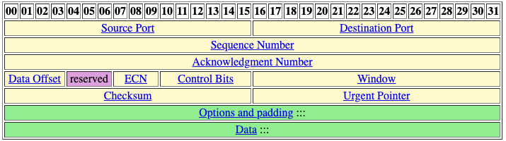
- Source Port number:  2 bytes, 16 bits
- Destination Port number:  2 bytes, 16 bits
- Sequence Number: 4 bytes, 32 bits
    
    The sequence number of the first data byte in this segment. If the SYN bit is set, the sequence number is the initial sequence number and the first data byte is initial sequence number + 1.


- Acknowledgment Number: 4 bytes, 32 bits
  
  If the ACK bit is set, this field contains the value of the next sequence number the sender of the segment is expecting to receive. Once a connection is established this is always sent.

- Data Offset. 4 bits.

    The number of 32-bit words in the TCP header. This indicates where the data begins. The length of the TCP header is always a multiple of 32 bits.

    The purpose of the data offset is to tell the upper layers where the data starts. As you point out, the TCP header can be anywhere from 5-15 words long. So you need to know where the header ends and the data begins.

    `word` unit is defined as 32 bits, So a header 5 words long is 20 bytes and a 15 words header is 60 bytes.
    
    to calculate the lenth of tcp header in `words`
    ```
    tcpdumc tcp[12]&0xf0)
    ```
    or in bytes
     ```
    tcpdumc tcp[12]&0xf0)>>2
    ```   
- reserved. 3 bits.

    Must be cleared to zero.

- ECN, Explicit Congestion Notification. 3 bits.

    00|	01|	02
    -|  - | -
    N|	C | E


    > - N, NS, Nonce Sum(concealment protection) 1 bit : This is an optional field added to ECN intended to protect against accidental or malicious concealment of marked packets from the TCP sender.

    > - C, CWR(congestion window has been reduced) 1 bit: Indicates that the sending host has received a TCP segment with the ECE flag set. The congestion window is an internal variable maintained by TCP to manage the size of the send window. 


    > - E, ECE, ECN-Echo. 1 bit: TCP peer is ECN-capable,Indicates that a TCP peer is ECN-capable during the TCP 3-way handshake and to indicate that a TCP segment was received on the connection with the ECN field in the IP header set to 11.


 

- Control Bits(TCP flags). 6 bits.

    00|	01|	02|	03|	04|	05
    - | - | - | - | - | - 
    U |	A | P | R | S | F

    > - U, URG. 1 bit: Urgent pointer valid flag, urgent byte in packet at location indicated in the “urgent” field

    > - A, ACK. 1 bit: Acknowledgment number valid flag, indicates that the acknowledgement number is valid

    > - P, PSH. 1 bit: Push flag, do not buffer – push the packet to the application

    >- R, RST. 1 bit: Reset connection flag, rejection of TCP packet

    > - S, SYN. 1 bit: Synchronize sequence numbers flag, used for connection establishment

    > - F, FIN. 1 bit: End of data flag, for termination of connection (I have no more data to send)
    
    > -  Only the PSH, RST, SYN, and FIN flags are displayed in tcpdump‘s flag field output. URGs and ACKs are displayed, but they are shown elsewhere in the output rather than in the flags field 

    > - Keep in mind the reasons these filters work. The filters above find these various packets because tcp[13] looks at offset 13 in the TCP header, the number represents the location within the byte, and the !=0 means that the flag in question is set to 1, i.e. it’s on.
    
    examples:

    - Show all URG packets:
        ```
        # tcpdump 'tcp[13] & 32 != 0'
        ````
    - Show all ACK packets:
        ```
        # tcpdump 'tcp[13] & 16 != 0'
        ```
    - Show all PSH packets:
        ```
        # tcpdump 'tcp[13] & 8 != 0'
        ```
    - Show all RST packets:
        ```
        # tcpdump 'tcp[13] & 4 != 0'
        ```

    - Show all SYN packets:
        ```
        # tcpdump 'tcp[13] & 2 != 0'
        ```

    - Show all FIN packets:
        ```
        # tcpdump 'tcp[13] & 1 != 0'
        ```
    - Show all SYN-ACK packets:
        ```
        # tcpdump 'tcp[13] = 18'
        ```
    - show only the SYN and FIN packets 
        ```
        tcpdump 'tcp[tcpflags] & (tcp-syn|tcp-fin) != 0'
        ```
    -  select the TCP packets with flags RST and ACK both set.
        ```
        tcpdump tcp[tcpflags] & (tcp-rst|tcp-ack) == (tcp-rst|tcp-ack)
        ```
    - 
- Window. 16 bits, unsigned.

    The number of data bytes beginning with the one indicated in the acknowledgment field which the sender of this segment is willing to accept.

- Checksum. 16 bits.

    This is computed as the 16-bit one's complement of the one's complement sum of a pseudo header of information from the IP header, the TCP header, and the data, padded as needed with zero bytes at the end to make a multiple of two bytes. The pseudo header contains the following fields:


- Urgent Pointer. 16 bits, unsigned.

    If the URG bit is set, this field points to the sequence number of the last byte in a sequence of urgent data.
- Options. 0 to 40 bytes.

    Options occupy space at the end of the TCP header. All options are included in the checksum. An option may begin on any byte boundary. The TCP header must be padded with zeros to make the header length a multiple of 32 bits.

### Understand UDP header
UDP header (UDP header has just 8 bytes)
   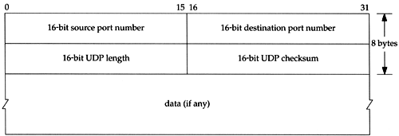
- source port: Source Port is a 2 Byte long field used to identify the port number of the source.
- destination port: It is a 2 Byte long field, used to identify the port of the destined packet.
- Length: It is the length of UDP including the header and the data. It is a 16-bits field.
- Checksum: It is 2 Bytes long field. It is the 16-bit one’s complement of the one’s complement sum of the UDP header, the pseudo-header of information from the IP header, and the data, padded with zero octets at the end (if necessary) to make a multiple of two octets.


### Understand ICMP header

ICMP header has two parts. The first four bytes are available for all types of ICMP messages. The first four bytes contains "Type", "Code" and "Checksum" fields in an ICMP header. First four bytes of ICMP header is shown below.

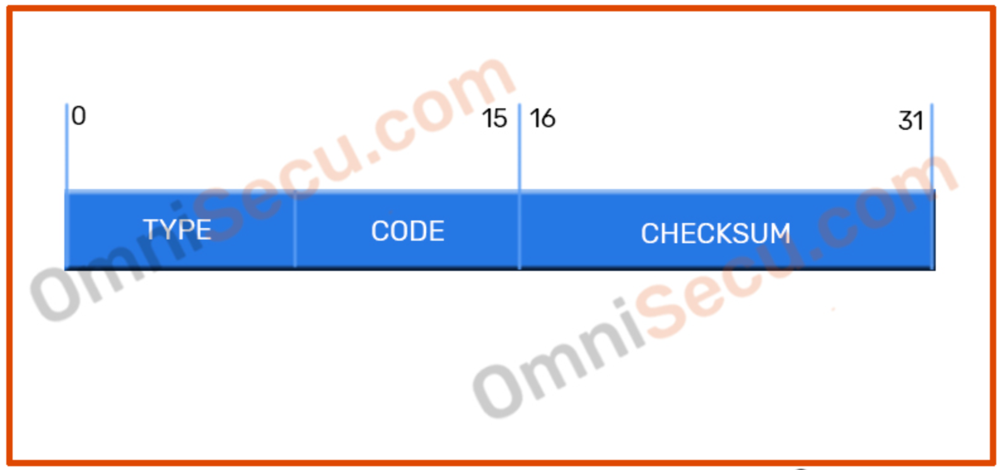

- Type and Code : The following table shows the values which are possible for the Type and Code fields in the Internet Control Message Protocol (ICMP) header.


    <table class="omni-default-table para-center">
    <tbody><tr>
      <th>Type Number</th>
      <th>Code</th>
      <th>Description</th>
    </tr>
    <tr>
      <td>0 - Echo Reply</td>
      <td>0</td>
      <td>Echo reply (used for Ping/Tracert etc)</td>
    </tr>
    <tr>
      <td>1 and 2</td>
      <td><p class="para-center">&nbsp;</p></td>
      <td>Reserved</td>
    </tr>
    <tr>
      <td rowspan="14">3 - Destination unreachable</td>
      <td>0</td>
      <td>Destination network unreachable</td>
    </tr>
    <tr>
      <td>1</td>
      <td>Destination host unreachable</td>
    </tr>
    <tr>
      <td>2</td>
      <td>Destination protocol unreachable</td>
    </tr>
    <tr>
      <td>3</td>
      <td>Destination <a href="https://www.omnisecu.com/tcpip/tcp-port-numbers.php" target="_blank" class="inside-link">port</a> unreachable</td>
    </tr>
    <tr>
      <td>4</td>
      <td><a href="https://www.omnisecu.com/tcpip/internet-layer.php" target="_blank" class="inside-link">Fragmentation</a> required, and <a href="https://www.omnisecu.com/tcpip/internet-layer.php" target="_blank" class="inside-link">DF</a> set</td>
    </tr>
    <tr>
      <td>5</td>
      <td>Source route failed</td>
    </tr>
    <tr>
      <td>6</td>
      <td>Destination network unknown</td>
    </tr>
    <tr>
      <td>7</td>
      <td>Destination host unknown</td>
    </tr>
    <tr>
      <td>8</td>
      <td>Source host isolated</td>
    </tr>
    <tr>
      <td>9</td>
      <td>Network administratively prohibited</td>
    </tr>
    <tr>
      <td>10</td>
      <td>Host administratively prohibited</td>
    </tr>
    <tr>
      <td>11</td>
      <td>Network unreachable for Type Of Service</td>
    </tr>
    <tr>
      <td>12</td>
      <td>Host unreachable for Type of Service</td>
    </tr>
    <tr>
      <td>13</td>
      <td>Administratively prohibited</td>
    </tr>
    <tr>
      <td>4 - Source Quench</td>
      <td>0</td>
      <td>Traffic Congestion Control</td>
    </tr>
    <tr>
      <td rowspan="4">5 - Redirect Message</td>
      <td>0</td>
      <td>Redirect Datagram for the Network</td>
    </tr>
    <tr>
      <td>1</td>
      <td>Redirect Datagram for the Host</td>
    </tr>
    <tr>
      <td>2</td>
      <td>Redirect Datagram for the Type of Service &amp; network</td>
    </tr>
    <tr>
      <td>3</td>
      <td>Redirect Datagram for the Type of Service &amp; host</td>
    </tr>
    <tr>
      <td>6 - Alternate Host Address</td>
      <td><p class="para-center">&nbsp;</p></td>
      <td>Alternate Host Address - Deprecated</td>
    </tr>
    <tr>
      <td>7</td>
      <td><p class="para-center">&nbsp;</p></td>
      <td>Reserved</td>
    </tr>
    <tr>
      <td>8 - Echo Request</td>
      <td>0</td>
      <td>Echo request</td>
    </tr>
    <tr>
      <td>9 - Router Advertisement</td>
      <td>0</td>
      <td>Router Advertisement</td>
    </tr>
    <tr>
      <td>10 - Router Solicitation</td>
      <td>0</td>
      <td>Router discovery/selection/solicitation</td>
    </tr>
    <tr>
      <td rowspan="2">11 - Time Exceeded</td>
      <td>0</td>
      <td>TTL expired</td>
    </tr>
    <tr>
      <td>1</td>
      <td>Fragment reassembly time exceeded</td>
    </tr>
    <tr>
      <td rowspan="3">12 - Parameter Problem</td>
      <td>0</td>
      <td>Pointer indicates the error</td>
    </tr>
    <tr>
      <td>1</td>
      <td>Missing a required option</td>
    </tr>
    <tr>
      <td>2</td>
      <td>Bad length</td>
    </tr>
    <tr>
      <td>13 - Timestamp Request</td>
      <td>0</td>
      <td>Timestamp Request</td>
    </tr>
    <tr>
      <td>14 - Timestamp Reply</td>
      <td>0</td>
      <td>Timestamp Reply</td>
    </tr>
    <tr>
      <td>15 - Information Request</td>
      <td>0</td>
      <td>Information Request</td>
    </tr>
    <tr>
      <td>16 - Information Reply</td>
      <td>0</td>
      <td>Information Reply</td>
    </tr>
    <tr>
      <td>17 - Address Mask Request</td>
      <td>0</td>
      <td>Address Mask Request</td>
    </tr>
    <tr>
      <td>18 - Address Mask Reply</td>
      <td>0</td>
      <td>Address Mask Reply</td>
    </tr>
    <tr>
      <td>19</td>
      <td><p class="para-center">&nbsp;</p></td>
      <td>Reserved for security</td>
    </tr>
    <tr>
      <td>20 through 29</td>
      <td><p class="para-center">&nbsp;</p></td>
      <td>Reserved for robustness experiment</td>
    </tr>
    <tr>
      <td>30</td>
      <td>0</td>
      <td>Information Request</td>
    </tr>
    <tr>
      <td>31</td>
      <td><p class="para-center">&nbsp;</p></td>
      <td>Datagram Conversion Error</td>
    </tr>
    <tr>
      <td>32</td>
      <td><p class="para-center">&nbsp;</p></td>
      <td>Mobile Host Redirect</td>
    </tr>
    <tr>
      <td>33</td>
      <td><p class="para-center">&nbsp;</p></td>
      <td>Where-Are-You</td>
    </tr>
    <tr>
      <td>34</td>
      <td><p class="para-center">&nbsp;</p></td>
      <td>Here-I-Am</td>
    </tr>
    <tr>
      <td>35</td>
      <td><p class="para-center">&nbsp;</p></td>
      <td>Mobile Registration Request</td>
    </tr>
    <tr>
      <td>36</td>
      <td><p class="para-center">&nbsp;</p></td>
      <td>Mobile Registration Reply</td>
    </tr>
    <tr>
      <td>37</td>
      <td><p class="para-center">&nbsp;</p></td>
      <td>Domain Name Request</td>
    </tr>
    <tr>
      <td>38</td>
      <td><p class="para-center">&nbsp;</p></td>
      <td>Domain Name Reply</td>
    </tr>
    <tr>
      <td>39 - SKIP Algorithm</td>
      <td><p class="para-center">&nbsp;</p></td>
      <td>SKIP Algorithm Discovery Protocol</td>
    </tr>
    <tr>
      <td>40 - Photuris protocol</td>
      <td><p class="para-center">&nbsp;</p></td>
      <td>Photuris (Firefly) security protocol</td>
    </tr>
    <tr>
      <td>41</td>
      <td><p class="para-center">&nbsp;</p></td>
      <td>ICMP for experimental mobility protocols such as Seamoby</td>
    </tr>
    <tr>
      <td>42 through 255</td>
      <td><p class="para-center">&nbsp;</p></td>
      <td>Reserved</td>
    </tr>
    </tbody></table>
- Checksum : The checksum field in the Internet Control Message Protocol (ICMP) message contains error checking data calculated from the Internet Control Message Protocol (ICMP) header+data, with value 0 for this field.

- The contents of the remaining part of ICMP packet depends on the ICMP message type. For example; ID (identifier) and SEQUENCE (sequence number) fields are the next four bytes (32 bits) after Type, Code and Checksum fields in an Echo Request and Echo reply ICMP message. Please refer below image.

    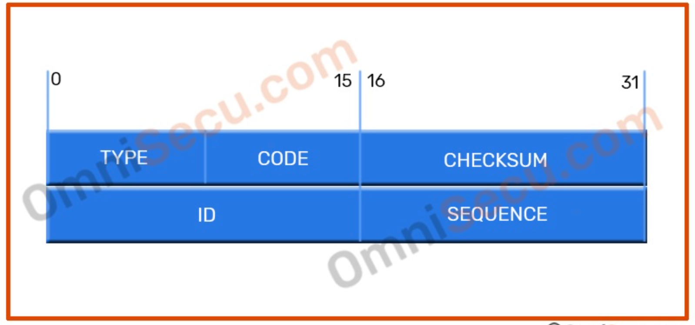

- ID : The ID field in the Internet Control Message Protocol (ICMP) message contains an ID value, should be returned in case of ECHO REPLY.

- Sequence number : The sequence number field in the Internet Control Message Protocol (ICMP) message is the sequence number for each host, and is incremented by 1 for each packet.

    filter ICMP echo-reply
    ```
    tcpdump -i eth0 "icmp[0] == 0"
    ```
    To filter ICMP echo-requests
    ```
    tcpdump -i eth0 "icmp[0] == 8"
    ```
    In IPv6, an IPv6 packet is 40 bytes long, and the first 8 bits of the ICMPv6 header specify its type.  We can use this tcpdump command to filter all ICMPv6 packets.

    We can use this tcpdump command to filter ICMPv6 echo-requests.
    ```
    # tcpdump -i eth0 "icmp6 && ip6[40] == 128"
    ```
    In the latest versions of tcpdump/libpcap,  we can use the following command to capture ICMPv6 echo packets.
    ```
    # tcpdump -i eth0 'icmp6[icmp6type]=icmp6-echo'
    ```

### Understand DHCP header 

  All Dynamic Host Configuration Protocol (DHCP) messages include a FIXED format section and a VARIABLE format section. The fixed format section consists of several fields that are the same in every Dynamic Host Configuration Protocol (DHCP) message. The variable format section in the Dynamic Host Configuration Protocol (DHCP) contains "OPTIONS", which carry additional configuration parameters.

  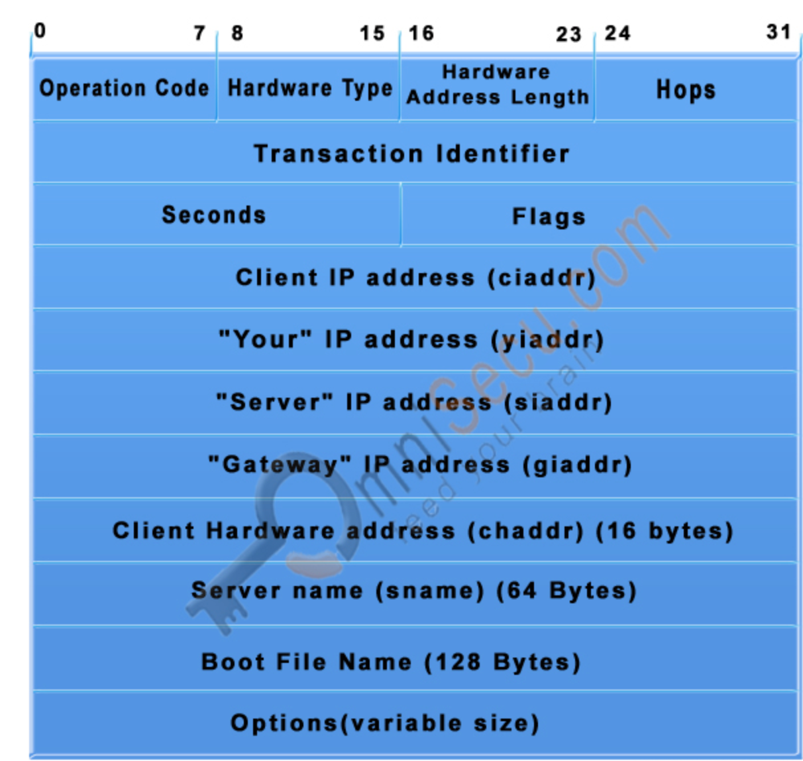

- Operation Code: 1 byte, Specifies the type of the Dynamic Host Configuration Protocol (DHCP) message. Set to 1 in messages sent by a client (requests) and 2 in messages sent by a server (response).
    - 1: BOOTREQUEST, Boot request.
    - 2: BOOTREPLY, Boot reply.
- Hardware Type: 1 byte, Specifies the network LAN architecture. For example, the ethernet type is specified when htype is set to 1.

    Value	|Description
    --------|-----------
    1	| Ethernet.	 
    2	| Experimental Ethernet.	 
    3	| Amateur Radio AX.25.	 
    4	| Proteon ProNET Token Ring.	 
    5	| Chaos.	 
    6	| IEEE 802.	 
    7	| ARCNET.	 
    8	| Hyperchannel.	 
    9	| Lanstar.	 
    10	| Autonet Short Address.	 
    11	| LocalTalk.	 
    12	| LocalNet (IBM PCNet or SYTEK LocalNET).	 
    13	| Ultra link.	 
    14	| SMDS.	 
    15	| Frame Relay.	 
    16	| ATM, Asynchronous Transmission Mode.	 
    17	| HDLC.	 
    18	| Fibre Channel.	
    19	| ATM, Asynchronous Transmission Mode.
    20	| Serial Line.	 
    21	| ATM, Asynchronous Transmission Mode.	 
    22	| MIL-STD-188-220.	 
    23	| Metricom.	 
    24	| IEEE 1394.1995.	
    25	| MAPOS.	 
    26	| Twinaxial.	 
    27	| EUI-64.	 
    28	| HIPARP.	 
    29	| IP and ARP over ISO 7816-3.	 
    30	| ARPSec.	 
    31	| IPsec tunnel.	RFC 3456
    32	| Infiniband.	RFC 4391
    33	| CAI, TIA-102 Project 25 Common Air Interface.	 
    34	| Wiegand Interface.	 
    35	| Pure IP.
- Hardware Address Length: 1 byte, Layer 2 (Data-link layer) address length (MAC address) (in bytes); defines the length of hardware address in the chaddr field. For Ethernet (Most widely used LAN Standard), this value is 6.
- Hops: 1 byte,	Number of relay agents that have forwarded this message.
- Transaction identifier: 4 bytes, Used by clients to match responses from servers with previously transmitted requests.
- seconds: 2 bytes,	Elapsed time (in seconds) since the client began theDynamic Host Configuration Protocol (DHCP) process.
- Flags: 2bytes, The leftmost bit is defined as the BROADCAST (B) flag. If this flag is set to 0, the DHCP server sent a reply back by unicast; if this flag is set to 1, the DHCP server sent a reply back by broadcast. The remaining bits of the flags field are reserved for future use.
- ciaddr: 4 bytes, Client's IP address; set by the client when the client has confirmed that its IP address is valid.
- yiaddr: 4 bytes, Client's IP address; set by the server to inform the client of the client's IP address.
- siaddr: 4 bytes, IP address of the next server for the client to use in the configuration process (for example, the server to contact for TFTP download of an operating system kernel).
- giaddr: 4 bytes, Relay agent (gateway) IP address; filled in by the relay agent with the address of the interface through which Dynamic Host Configuration Protocol (DHCP) message was received.
- chaddr: 4 bytes,	Client's hardware address (Layer 2 address).
- sname: 4 bytes, Name of the next server for client to use in the configuration process.
- file: 4 bytes, Name of the file for the client to request from the next server (for example the name of the file that contains the operating system for this client).
- BOOTP/DHCP options. Variable length. The first four bytes contain the (decimal) values 99, 130, 83 and 99. This is the same magic cookie as has been defined for BOOTP. The remainder of the field consists of a list of tagged parameters that are called options. All of the vendor extensions used by BOOTP are also DHCP options.


### Understand SSL/TLS
  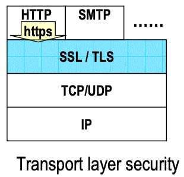

  SSL/TLS layer is on top of TCP layer, so SLL/TLS packets stay in the TCP `data offset` segment. In TLS/SSL, all data sent is encapsulated in a **record** , an object which is composed of a header and some non-zero amount of data. Each record header contains a two or three byte length code. 

  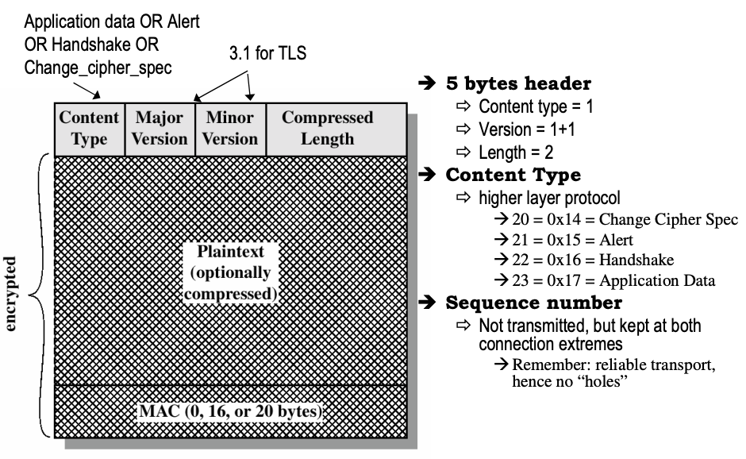

  #### for SSLv2:
  
  record header contains a two or three byte length code. If the most significant bit is set in the `first byte` of the record length code then the record has no padding and the total header length will be 2 bytes, otherwise the record has padding and the total header length will be 3 bytes. The record header is transmitted before the data portion of the record.
  - `Fisrt` bit 
    - 1: no padding, the total header will be 2 bytes
    - 0: padding, the total header will be 3 bytes
  - for `3 byte` header, the `second` most significant bit in the first byte has special meaning. 
    - 0: the record being sent is a data record. 
    - 1: the record being sent is a security escape (there are currently no examples of security escapes; this is reserved for future versions of the protocol). 
    - other: the length code describes how much data is in the record.


  #### For SSLv3/TLS:

  `tcp[((tcp[12] & 0xf0) >> 2)]`: `tcp[12]` means capturing the 13th byte of the tcp packet, corresponding to first half being the offset, second half being reserved. The offset, once multiplied by 4 gives the byte count of the TCP header, meaning ((tcp[12] & 0xf0) >> 2) provides the size of the TCP header, thus captures every packet having the first byte after the TCP header

  - first byte of the TLS record indicates the record type

    - 0x14 Change Cipher Spec
    - 0x15 Encrypted Alert
    - 0x16 Handshake
    - 0x17 Application Data
    - so if >0x17 or <0x14, it means it is not a valid TLS/SSLv3 record, maybe a SSLv2 record
  - the second and third byte of the TLS Record indicate the version in use:
    - 0x0300	SSLv3
    - 0x0301	TLS 1.0
    - 0x0302	TLS 1.1
    - 0x0303	TLS 1.2
    - 0x0304	TLS 1.3

  - TLS handshake
    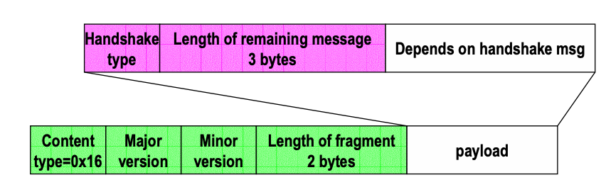
    hanshake types
    - hello_request(0), 
    - client_hello(1), 
    - server_hello(2),
    - certificate(11), 
    - server_key_exchange (12),
    - certificate_request(13), 
    - server_hello_done(14),
    - certificate_verify(15), 
    - client_key_exchange(16),
    - finished(20)
  - Change Cipher Spec
    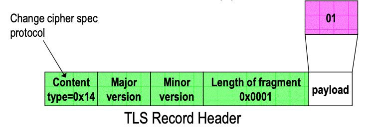
  - Alert protocol
    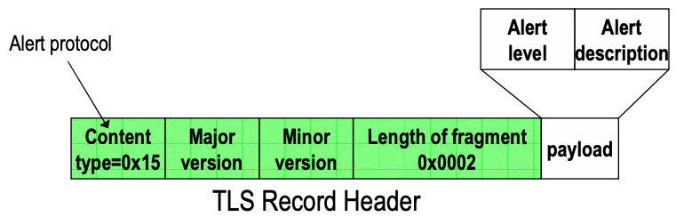
    Alert Protocol format (2 bytes):
    - First byte: Alert Level
      - warning(1), 
      - fatal(02)
    - Second Byte: Alert Description
      - 23 possible alerts

  - according to https://tls.ulfheim.net/, we can see that the client TLS version also record in 10th and 11th byte same as 2th and 3rd byte
    - 10the byte
    ```
    tcp[((tcp[12] & 0xf0) >> 2)+9] = 0x03
    ```
    - 11th byte
    ```
    tcp[((tcp[12] & 0xf0) >> 2)+10] < 0x03
    ```
    
### Links
- https://unit42.paloaltonetworks.com/wireshark-tutorial-decrypting-https-traffic/
- https://sites.google.com/site/jimmyxu101/testing/use-tcpdump-to-monitor-http-traffic
- https://support.f5.com/csp/article/K50557518
- https://gist.github.com/bom-d-van/b3ab3e6e924e31bacebae3a508cbd3eb
- https://didattica-2000.archived.uniroma2.it//iss/deposito/4_tls.pdf
- https://www.netmeister.org/blog/tcpdump-ssl-and-tls.html
- https://github.com/syncsynchalt/illustrated-tls
- https://tls.ulfheim.net/
- https://github.com/syncsynchalt/illustrated-tls13
- https://tls13.ulfheim.net/
- https://floatingoctothorpe.uk/2018/detecting-uptime-from-tcp-timestamps.html