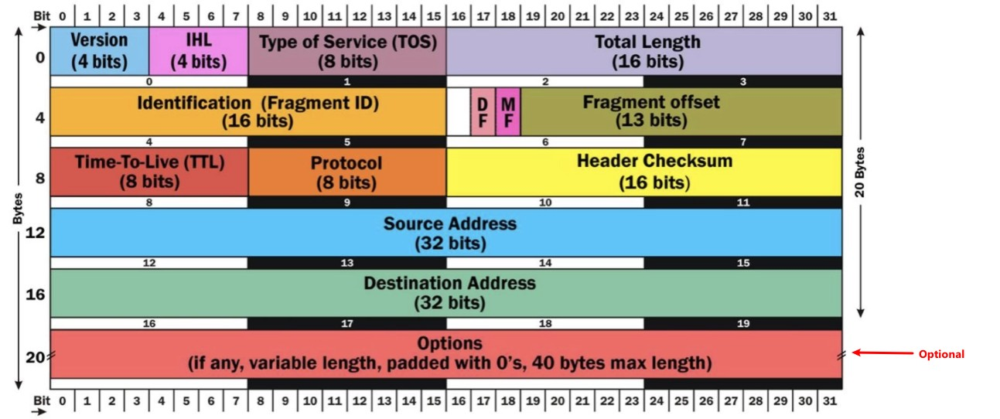

Tcpdump/wireshark
---

recently I need to use tool to find the wechat content history of official accounts to print them as html or pdf, previously fiddler is used, but it is a commercial software, so I am thinking to use tcpdump/wireshark to capture the packet and to find the exact URL

### capture and decode http(s) contents
1. prequisities 
   - to decode a https requests and responses, an environment `SSLKEYLOGFILE` to be added to point a file on local machine, whether it is `windows`/`Linux`/`Mac`, acoording to https://support.f5.com/csp/article/K50557518
   - This file is an encryption key log with  text format,these logs are created using a Man in the Middle (MitM) technique when the pcap is originally recorded. If no such file was created when the pcap was recorded, you cannot decrypt HTTPS traffic in that pcap.
  - when access the website while also using tcpdump or wireshark to capture the packets, also this filled with decrypt keys

  > this can not be used when using a proxy to access the website
2. Analyze
   1. using wireshark to open pcap file
   2. specify the ssl key log file, `Edit` --> `Preference` -->`Protocols` --> `TLS`--> `(Pre)Master Secret log file`, use `Browse` to spefify the ssl key log file location, then click `OK`
   3. wireshark window can disply http request headers, requests, ..etc. 
      

      Here I can see all headers, request URL for further analysis.


### Understand IP header
   A typical IP header is 20 bytes(if no tcp Options are set), the option segment is variable from 0 to 40 bytes.
   
- First byte
   - The first half of first byte(Version):
      - if `0100`: `4`: means ipv4
   - The second half of first byte(IHL)
      - if `0101` = `5` in decimal. This is the number of blocks of 32 bits in the headers. 5 x 32 bits = 160 bits or 20 bytes.
      - indicates the header lenth
   - to calculate first byte in decimal, `01000101`: is `69`, a typical IPv4 first byte is `69`
   - any value that larger than `69` means
      - ipv4 with IP option set or 
      - ipv6 
   - to filter if we had IP options set
      ```
      tcpdump -i eth1 'ip[0] > 69'
      ```
      > not really, because possiblly it is a ipv6 packet
   - the proper way, "masking" the first half of the byte
      ```
      0100 0101 : 1st byte originally
      0000 1111 : mask
      =========
      0000 0101 : final result
      ```
      >  (0xf in hex or 15 in decimal). 0 will mask the values while 1 will keep the values intact
      In binary,so it should be 
      ```
      # tcpdump -i eth1 'ip[0] & 15 > 5'
      ```
      or in hexadecimal
      ```
      # tcpdump -i eth1 'ip[0] & 0xf > 5'
      ```
   - recap
      - keep the last 4 bits intact, use 0xf (binary 00001111)
      - keep the first 4 bits intact, use 0xf0 (binary 11110000)
- 2nd byte
   - Type of Service (ToS) - The 8-bit ToS uses 3 bits for IP Precedence, 4 bits for ToS with the last bit not being used. The 4-bit ToS field, although defined, has never been used.
   - IP Precedence: used to prioritize IP traffic 
      - 000: Routing or Best Effort
      - 001: Priority
      - 010: Immediate
      - 011: Flash
      - 100: Flash Override
      - 101: Critical
      - 110: Internetwork Control
      - 111: Network Contral
   - Type of Service Values
      - 0000: Normal Delvery
      - 0001: Minimize Cost
      - 0010: Maximize Reliability
      - 0100: Maximize Throughput
      - 1000: Minimize Delay
   - Differentiated Services Code Point (DSCP) - A 6-bit field used to identify the level of service a packet receives in the network. DSCP is a 3-bit expansion of IP precedence with the elimination of the ToS bits.
      
      Name |	Value (Binary) |	Value (Decimal) |Reference | equivilant of TOS
      -----|------------------|-------------|----------|----------
      CS0	|000000|	0	|[RFC2474]|Routing
      CS1	|001000|	8	|[RFC2474]|
      CS2	|010000|	16	|[RFC2474]
      CS3	|011000|	24	|[RFC2474]
      CS4	|100000|	32	|[RFC2474]
      CS5	|101000|	40	|[RFC2474]
      CS6	|110000|	48	|[RFC2474]
      CS7	|111000|	56	|[RFC2474]
      AF11	|001010|	10	|[RFC2597]|Priority
      AF12	|001100|	12	|[RFC2597]|Priority
      AF13	|001110|	14	|[RFC2597]|Priority
      AF21	|010010|	18	|[RFC2597]|Immediate
      AF22	|010100|	20	|[RFC2597]|Immediate
      AF23	|010110|	22	|[RFC2597]|Immediate
      AF31	|011010|	26	|[RFC2597]|Flash
      AF32	|011100|	28	|[RFC2597]|Flash
      AF33	|011110|	30	|[RFC2597]|Flash
      AF41	|100010|	34	|[RFC2597]|Flash Override
      AF42	|100100|	36	|[RFC2597]|Flash Override
      AF43	|100110|	38	|[RFC2597]|Flash Override
      EF    |101110|	46	|[RFC3246] |Critical
      VOICE-ADMIT | 101100 |	44|[RFC5865]


- DF bit (don't fragment) set ?

   check if fragmentation occuring, which is not desirable. Fragmentation occurs 
when a the MTU of the sender is bigger than the path MTU on the path to destination.

   Fragmentation info can be found in the 7th and 8th byte of the IP header.

      +-+-+-+-+-+-+-+-+-+-+-+-+-+-+-+-+
      |Flags|      Fragment Offset    |
      +-+-+-+-+-+-+-+-+-+-+-+-+-+-+-+-+

   - Flags(3 bits)
      - Bit 0: 	reserved, must be zero
      - Bit 1: 	(DF) 0 = May Fragment, 1 = Don't Fragment.
      - Bit 2: 	(MF) 0 = Last Fragment, 1 = More Fragments.
   - Fragment Offset
      - only used when fragmentation occurs.

   - If we want to match the DF bit (don't fragment bit, to avoid IP fragmentation) :

      The 7th byte would have a value of :
      `01000000` or `64` in decimal
      ```
      # tcpdump -i eth1 'ip[6] = 64'
      ```
   - Matching fragmentation ?
      - if this is not the last fragment, so more gragments,`00100000` is `32`
         ```
         tcpdump -i eth1 'ip[6] = 32'
      - if it is the last fragment, 
         - first 3 bits are 0, but the fragment data may not, so the tail `5` bits should not zero, 
         - also the whole byte can't be `64` as it already has fragment
         ```
          tcpdump -i eth1 '((ip[6:2]>0) and (not ip[6]=64))'
          ```
          > - `ip[6:2]` is starting to filter 7th byte for 2 bytes, that is 7th and 8th byte

- Matching datagrams with low TTL
   - The TTL field is located in the 9th byte and fits perfectly into 1 byte.
   - We can try to find if someone on our network is using traceroute by using something like this on the gateway :
   ```
   # tcpdump -i eth1 'ip[8] < 5'
   ```
- Matching packets longer than X bytes
   - packets longer is configured in 3rd and 4th byte, totoally 16 bites
   - Matching packets longer than X bytes
      ```
      # tcpdump -i eth1 'ip[2:2] > 600'
      ```
      > - filter from 3rd byte for 2 bytes, that is 3rd and 4th byte
      > - this example filter packet larger than 600 bytes
- protocol
   - 10th byte indicates the protocols
      - 1 = ICMP; 
      - 2= IGMP; 
      - 6 = TCP; 
      - 17= UDP
   - but we can directly use tcp to filter tcp packet, udp for udp packet, not doing here
### Understand TCP header
   Each TCP header has 10 required fields totally 20 bytes (160 bits) in size. It can optionally include an additional data field up to 40 bytes in size.
   
- Source Port number:  2 bytes, 16 bits
- Destination Port number:  2 bytes, 16 bits
- Sequence Number: 4 bytes, 32 bits
    
    The sequence number of the first data byte in this segment. If the SYN bit is set, the sequence number is the initial sequence number and the first data byte is initial sequence number + 1.


- Acknowledgment Number: 4 bytes, 32 bits
  
  If the ACK bit is set, this field contains the value of the next sequence number the sender of the segment is expecting to receive. Once a connection is established this is always sent.

- Data Offset. 4 bits.

    The number of 32-bit words in the TCP header. This indicates where the data begins. The length of the TCP header is always a multiple of 32 bits.
- reserved. 3 bits.

    Must be cleared to zero.

- ECN, Explicit Congestion Notification. 3 bits.

    00|	01|	02
    -|  - | -
    N|	C | E


    > - N, NS, Nonce Sum(concealment protection) 1 bit : This is an optional field added to ECN intended to protect against accidental or malicious concealment of marked packets from the TCP sender.

    > - C, CWR(congestion window has been reduced) 1 bit: Indicates that the sending host has received a TCP segment with the ECE flag set. The congestion window is an internal variable maintained by TCP to manage the size of the send window. 


    > - E, ECE, ECN-Echo. 1 bit: TCP peer is ECN-capable,Indicates that a TCP peer is ECN-capable during the TCP 3-way handshake and to indicate that a TCP segment was received on the connection with the ECN field in the IP header set to 11.


 

- Control Bits. 6 bits.

    00|	01|	02|	03|	04|	05
    - | - | - | - | - | - 
    U |	A | P | R | S | F

    > - U, URG. 1 bit: Urgent pointer valid flag.

    > - A, ACK. 1 bit: Acknowledgment number valid flag.

    > - P, PSH. 1 bit: Push flag.

    >- R, RST. 1 bit: Reset connection flag.

    > - S, SYN. 1 bit: Synchronize sequence numbers flag.

    > - F, FIN. 1 bit: End of data flag.
    
    > -  Only the PSH, RST, SYN, and FIN flags are displayed in tcpdump‘s flag field output. URGs and ACKs are displayed, but they are shown elsewhere in the output rather than in the flags field 

    > - Keep in mind the reasons these filters work. The filters above find these various packets because tcp[13] looks at offset 13 in the TCP header, the number represents the location within the byte, and the !=0 means that the flag in question is set to 1, i.e. it’s on.
    
    examples:

    - Show all URG packets:
        ```
        # tcpdump 'tcp[13] & 32 != 0'
        ````
    - Show all ACK packets:
        ```
        # tcpdump 'tcp[13] & 16 != 0'
        ```
    - Show all PSH packets:
        ```
        # tcpdump 'tcp[13] & 8 != 0'
        ```
    - Show all RST packets:
        ```
        # tcpdump 'tcp[13] & 4 != 0'
        ```

    - Show all SYN packets:
        ```
        # tcpdump 'tcp[13] & 2 != 0'
        ```

    - Show all FIN packets:
        ```
        # tcpdump 'tcp[13] & 1 != 0'
        ```
    - Show all SYN-ACK packets:
        ```
        # tcpdump 'tcp[13] = 18'
        ```
- Window. 16 bits, unsigned.

    The number of data bytes beginning with the one indicated in the acknowledgment field which the sender of this segment is willing to accept.

- Checksum. 16 bits.

    This is computed as the 16-bit one's complement of the one's complement sum of a pseudo header of information from the IP header, the TCP header, and the data, padded as needed with zero bytes at the end to make a multiple of two bytes. The pseudo header contains the following fields:


- Urgent Pointer. 16 bits, unsigned.

    If the URG bit is set, this field points to the sequence number of the last byte in a sequence of urgent data.
- Options. 0 to 40 bytes.

    Options occupy space at the end of the TCP header. All options are included in the checksum. An option may begin on any byte boundary. The TCP header must be padded with zeros to make the header length a multiple of 32 bits.

### Understand UDP header
UDP header (UDP header has just 8 bytes)
   
- source port: Source Port is a 2 Byte long field used to identify the port number of the source.
- destination port: It is a 2 Byte long field, used to identify the port of the destined packet.
- Length: It is the length of UDP including the header and the data. It is a 16-bits field.
- Checksum: It is 2 Bytes long field. It is the 16-bit one’s complement of the one’s complement sum of the UDP header, the pseudo-header of information from the IP header, and the data, padded with zero octets at the end (if necessary) to make a multiple of two octets.


### Links
- https://unit42.paloaltonetworks.com/wireshark-tutorial-decrypting-https-traffic/
- https://sites.google.com/site/jimmyxu101/testing/use-tcpdump-to-monitor-http-traffic
- https://support.f5.com/csp/article/K50557518
- https://gist.github.com/bom-d-van/b3ab3e6e924e31bacebae3a508cbd3eb