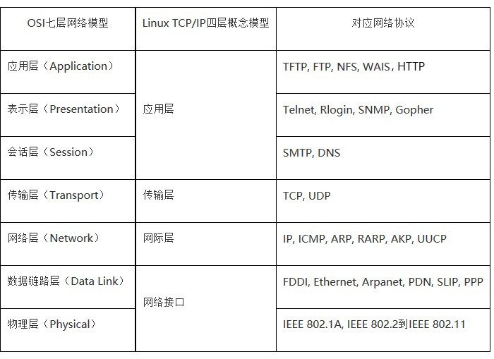
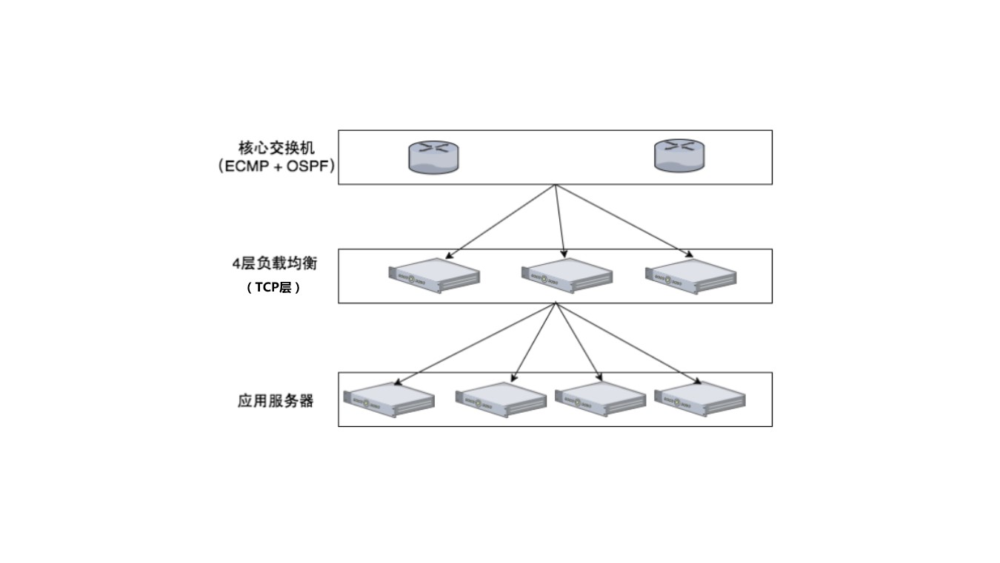

1. TCP/IP四层模型和OSI七层模型对应表. 
2. ECMP（Equal-Cost Multipath Routing）

   等价多路径，存在多条不同链路到达同一目的地址的网络环境中，如果使用传统的路由技术，发往该目的地址的数据包只能利用其中的一条链路，其它链路处于备份状态或无效状态，并且在动态路由环境下相互的切换需要一定时间，而等值多路径路由协议可以在该网络环境下同时使用多条链路，不仅增加了传输带宽，并且可以无时延无丢包地备份失效链路的数据传输。
　　ECMP最大的特点是实现了等值情况下，多路径负载均衡和链路备份的目的，在静态路由和OSPF中基本上都支持ECMP功能。 

    

    ECMP有几个问题：

    - 需要了解动态路由协议，LVS和交换机均需要复杂配置；
    - 交换机的Hash算法一般比较简单，增加删除节点会造成Hash重分布，可能导致当前TCP连接全部中断；
    - 部分交换机(华为6810)的ECMP在处理分片包时会有BUG。
3. [DPDK](http://dpdk.org)
    - description: DPDK is a set of libraries and drivers for fast packet processing.

    These libraries can be used to:

    - receive and send packets within the minimum number of CPU cycles (usually less than 80 cycles)
    - develop fast packet capture algorithms (tcpdump-like)
    - run third-party fast path stacks

    What it is not

    DPDK is not a networking stack and does not provide functions such as Layer-3 forwarding, IPsec, firewalling, etc. Within the tree, however, [various application examples](http://dpdk.org/browse/dpdk/tree/examples/) are included to help developing such features.

4. Load Balancer
    - [戏说：负载均衡 ](https://mp.weixin.qq.com/s/RbRcp-sjM6IhKqgwmt1FXg)
    - [Maglev](https://research.google.com/pubs/pub44824.html)
    - [MGW](https://tech.meituan.com/MGW.html)
    - [Vortex](http://www.infoq.com/cn/articles/Maglev-Vortex)

5. [Optimizing web servers for high throughput and low latency](https://blogs.dropbox.com/tech/2017/09/optimizing-web-servers-for-high-throughput-and-low-latency/)