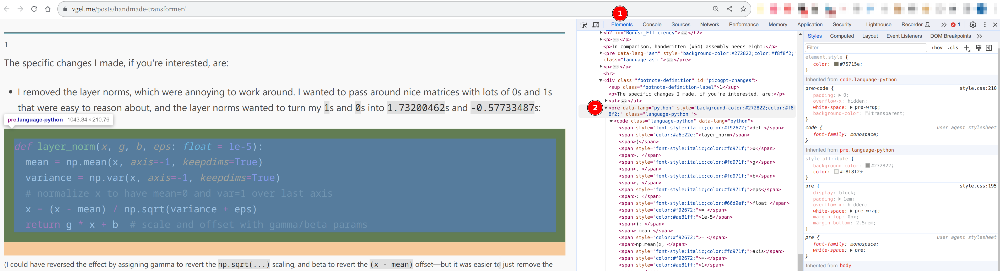
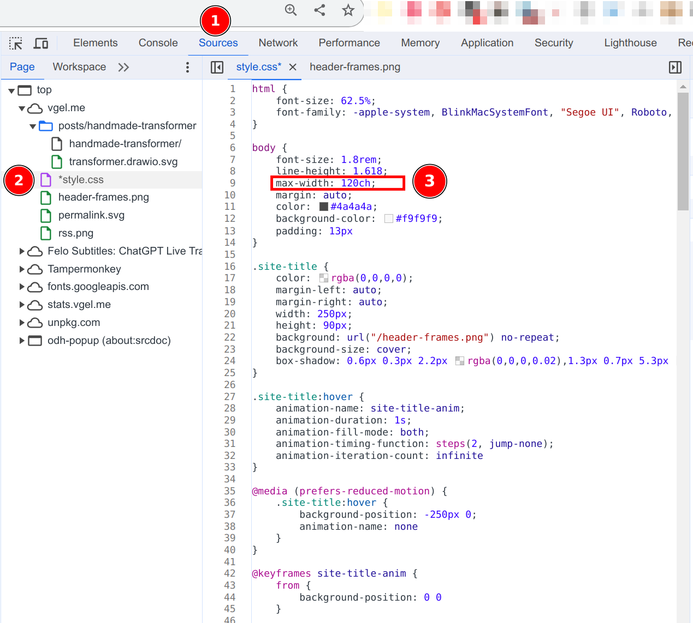
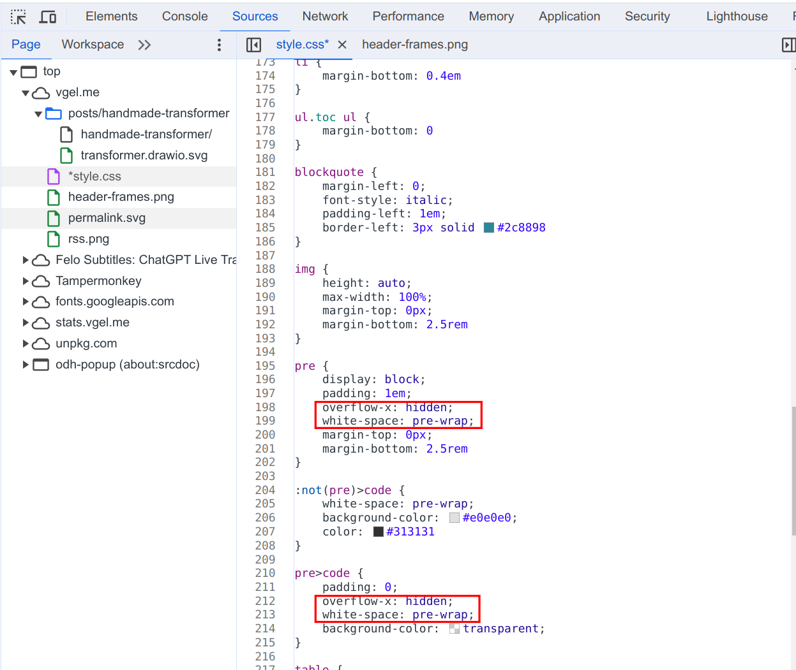

# Web Tips

1. when sometimes we want to print a htmp page with code, but the code is a block with scroll bar, it will not display all codes when printing, so we edit the css file
    - select the code block, and then right click and select `inspect`, we will find the css element that used for the code block, as shown below, the code is in `<pre>` and `pre>code`
    
    - increase the page size, the default is `90 inch`,we can increase to `120 inch` because some code block may be too long,
    
    - modify the `</pre>` and `pre>code`, change or add `overflow-x: hidden;` and `white-space: pre-wrap;`
    
    - after that, we can print the page to pdf with full code included
