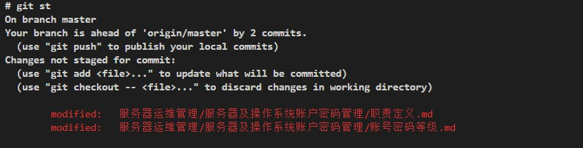

1. git status can display chinese path.

    Error shows as following image:

    

    from https://stackoverflow.com/questions/4144417/how-to-handle-asian-characters-in-file-names-in-git-on-os-x
    ```
    Git quotes any non-ascii character by default, not only asian ones. There's an option to disable this quoting behaviour.

    You can disable it using the following command:

    git config --global core.quotepath false
    Or, alternatively, by adding the following snippet to your git config file ($HOME/.gitconfig usually)

    [core]
        quotepath = false
    After this, git should show your filenames exactly as they are.
    ```
    
    after configure `quotepath`, it can display chinese path correctly.
    
